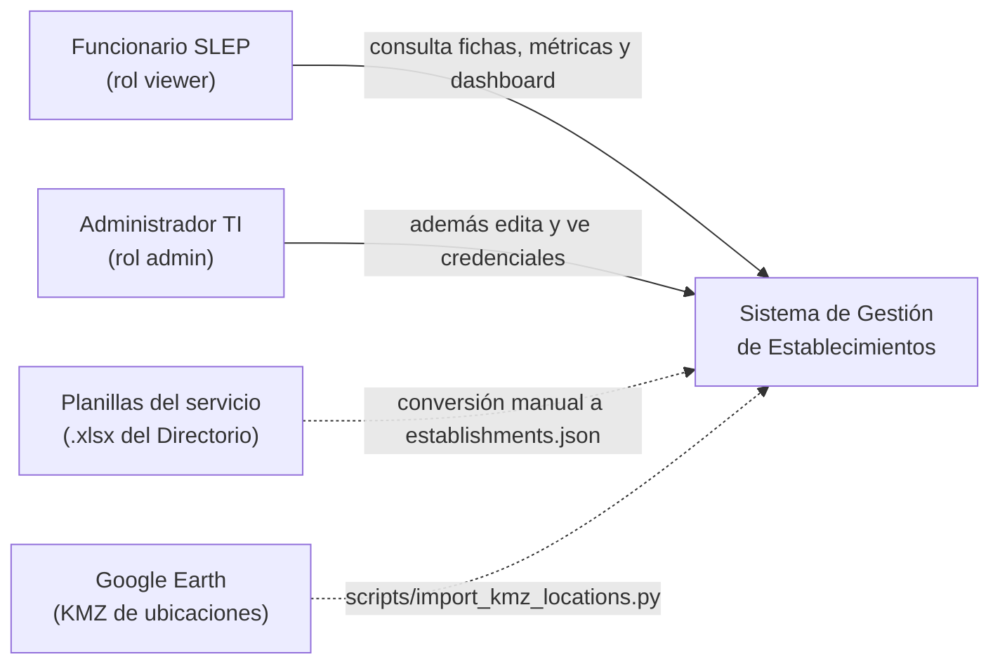
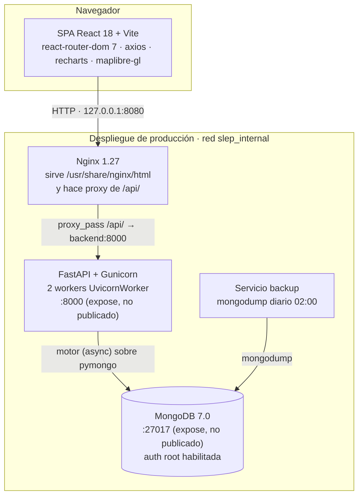
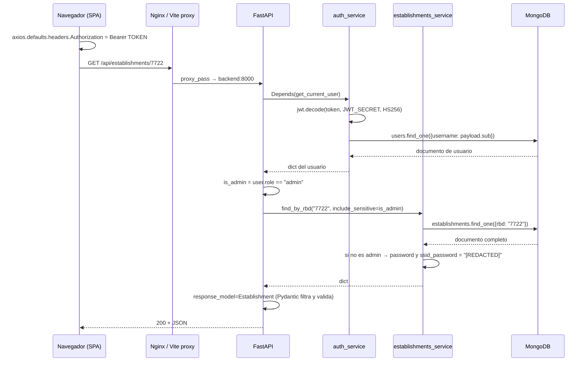

# 01 · Arquitectura

> **Alcance.** Estructura física y lógica del sistema: contenedores, capas, responsabilidades
> y el camino completo de una request. No cubre el contrato HTTP en detalle (`03`) ni el
> esquema de datos (`02`).
>
> **Verificado contra:** `backend/app/main.py`, `backend/app/config.py`, `backend/requirements.txt`,
> `frontend/package.json`, `frontend/vite.config.js`, `frontend/nginx.conf`,
> `docker-compose.yml`, `docker-compose.prod.yml`, `backend/Dockerfile*`, `frontend/Dockerfile.prod`.

---

## 1. Contexto (C4 nivel 1)



Dos tipos de usuario y dos fuentes de datos externas, ambas **offline**: el sistema no
consume ninguna API de terceros en tiempo de ejecución. Las planillas se convierten a
`backend/establishments.json` fuera del repositorio y ese archivo alimenta el seeding; las
coordenadas entran por un script que se ejecuta a mano.

> 🔸 **BRECHA:** la conversión de planilla a `establishments.json` no está automatizada ni
> documentada en el repositorio. `Documentacion/excel_details.txt` describe la estructura de
> la planilla origen, pero no existe un script de conversión versionado. Recargar datos
> desde una planilla nueva es hoy un procedimiento manual no reproducible.
>
> 🔸 **BRECHA:** la integración con el directorio de Google Workspace que el proyecto declara
> como objetivo no existe en el código. La autenticación es local (usuario/contraseña en
> MongoDB). Ver `06-decisiones-adr.md` ADR-006.

---

## 2. Contenedores (C4 nivel 2)



**Lo esencial del diagrama:** el frontend nunca habla con el backend por una URL absoluta.
Emite peticiones a rutas relativas `/api/...` (`frontend/src/App.jsx:48`,
`frontend/src/components/Login.jsx:36`, y el resto de componentes) y alguien delante las
redirige — Vite en desarrollo (`vite.config.js`, `server.proxy['/api'] → http://backend:8000`),
Nginx en producción (`nginx.conf`, `location /api/ → proxy_pass http://backend:8000`).

Esa decisión tiene dos consecuencias que hay que conocer antes de tocar nada:

1. **No existe variable de entorno con la URL del backend en el frontend.** No hay
   `VITE_API_URL`. Cambiar el destino de la API significa cambiar el proxy, no el código React.
2. **Mismo origen en el navegador.** Por eso CORS es irrelevante en la práctica para el
   frontend propio, y por eso el `allow_origins=["*"]` de `main.py` importa solo para
   clientes externos (ver `04-seguridad-y-acceso.md` §5).

En producción solo Nginx está publicado, y únicamente en `127.0.0.1:8080`
(`docker-compose.prod.yml`, servicio `frontend`): el backend y la base de datos no son
alcanzables desde fuera del host. Se asume un reverse proxy o túnel delante.

> ⚠️ **NO VERIFICADO:** qué hay delante de `127.0.0.1:8080` en el servidor real (Nginx del
> host, Cloudflare Tunnel, etc.) y si termina TLS. No hay configuración de ese nivel en el
> repositorio. Confirmar con quien opera el servidor.

---

## 3. Stack y versiones reales

Backend — `backend/requirements.txt`, base `python:3.11-slim` (`backend/Dockerfile`):

| Paquete | Restricción | Rol |
|---|---|---|
| `fastapi` | `>=0.110.0` | Framework HTTP, validación e inyección de dependencias |
| `uvicorn[standard]` | `>=0.28.0` | Servidor ASGI (desarrollo) |
| `motor` | `>=3.3.2` | Driver MongoDB asíncrono |
| `pymongo` | `>=4.6.2` | Driver base; aporta `bson.ObjectId` |
| `pydantic` | `>=2.6.3` | Modelos de entidad y serialización (**API v2**: `model_dump`, `populate_by_name`) |
| `passlib[bcrypt]` | `>=1.7.4` | Declarado |
| `pyjwt` | `>=2.8.0` | Emisión y verificación de JWT |
| `python-multipart` | `>=0.0.9` | Requerido por `OAuth2PasswordRequestForm` |
| `pandas`, `openpyxl` | `>=2.2.1`, `>=3.1.2` | Declarados |
| `gunicorn` | sin pin | Instalado solo en `Dockerfile.prod` |

> 🔸 **BRECHA:** `passlib[bcrypt]` está declarado pero no se importa en ninguna parte:
> `auth_service.py:4` y `seed_service.py:4` usan `bcrypt` directamente. `pandas` y
> `openpyxl` tampoco se importan bajo `backend/app/`. Tres dependencias transitivas pesadas
> sin uso verificable en el árbol de la aplicación.
>
> 🔸 **BRECHA:** ninguna dependencia está fijada a una versión exacta (`>=` en todas). Dos
> builds de la misma imagen en fechas distintas pueden traer versiones distintas de FastAPI
> o Pydantic. No hay lockfile en el backend (el frontend sí tiene `package-lock.json`).

Frontend — `frontend/package.json`:

React `^18.2.0` · Vite `^5.2.0` · `react-router-dom` `^7.18.3` · `axios` `^1.6.8` ·
`recharts` `^2.12.3` (gráficos) · `maplibre-gl` `^4.7.1` (mapa de ficha) ·
`tailwindcss` `^3.4.1` + `tailwindcss-animate` · `@radix-ui/*` + `class-variance-authority`
+ `clsx` + `tailwind-merge` (base de shadcn/ui) · `lucide-react` (íconos) ·
`vitest` `^4.1.11` + Testing Library (tests).

Nota: existe un `package.json` en la **raíz** del repositorio con un subconjunto duplicado
de dependencias (`react-router`, `shadcn`, `vitest`, Testing Library). No corresponde a
ninguna aplicación desplegable; es andamiaje del MCP de shadcn declarado en `opencode.json`.
No confundirlo con `frontend/package.json`, que es el real.

---

## 4. Estructura modular del backend

```
backend/
├── run.py                       # uvicorn app.main:app --reload (dev local sin Docker)
├── requirements.txt
├── pytest.ini                   # asyncio_mode=auto, testpaths=tests
├── establishments.json          # semilla (git-ignored — contiene datos reales)
├── data/SLEP_EE.kmz             # fuente de coordenadas
├── scripts/import_kmz_locations.py
├── tests/                       # conftest.py + test_BE0x / test_INT0x
└── app/
    ├── main.py                  # FastAPI(), CORS, lifespan, include_router × 5
    ├── config.py                # Settings (lectura de os.getenv, sin Pydantic Settings)
    ├── database/
    │   ├── database_service.py  # connect/close, ensure_indexes; delega el seed en seed_service
    │   └── seed_service.py      # seed_if_empty: admin user + establishments/counterparts/metrics
    ├── auth/                    # auth_entity · auth_service · auth_controller
    ├── establishments/          # establishments_entity · _service · _controller
    ├── counterparts/            # counterparts_entity · _service · _controller
    ├── metrics/                 # metrics_entity · _service · _controller
    └── analytics/               # analytics_service · analytics_controller (sin entity)
```

Cada módulo de dominio es una carpeta con **tres archivos de nombre predecible**. La
convención es rígida a propósito: permite ubicar cualquier cosa sin buscar, y es lo que hace
que la receta de `05-guia-de-extension.md` §1 sea mecánica.

### 4.1 Responsabilidad de cada capa

| Capa | Archivo | Responsabilidad | Prohibido |
|---|---|---|---|
| **Entity** | `*_entity.py` | Modelos Pydantic: forma de los datos, tipos, valores por defecto, enumeraciones del dominio. Es el contrato, en ambas direcciones. | Importar `db_service`. Contener lógica de negocio o consultas. |
| **Service** | `*_service.py` | Toda la interacción con MongoDB y toda la lógica de negocio: construcción de queries, proyecciones, agregaciones, redacción de campos sensibles. Recibe y devuelve `dict` o modelos, nunca objetos HTTP. | Importar `fastapi`. Lanzar `HTTPException`. Conocer el usuario autenticado — recibe `include_sensitive: bool`, no `current_user`. |
| **Controller** | `*_controller.py` | Declara el `APIRouter`, las rutas, los `Query`/`Path`/body, el `response_model`, la dependencia de autenticación, y traduce ausencia de resultado a código HTTP. | Consultar MongoDB directamente. Contener lógica de negocio o transformaciones de datos. |

La regla que más importa, porque es la que sostiene el resto:
**el service no sabe quién pregunta, el controller no sabe cómo se guarda.**
Se ve limpia en el par `establishments_controller.py:40-41` / `establishments_service.py:84`:
el controller decide `is_admin = current_user.get("role") == "admin"` y pasa un booleano;
el service redacta según ese booleano sin saber qué es un rol. Cualquiera de las dos mitades
se puede probar sin la otra, y de hecho `test_BE05` prueba las dos por separado.

Cada service se instancia una sola vez al final de su archivo (`establishments_service = EstablishmentsService()`)
y se importa ese singleton. No hay contenedor de inyección de dependencias: la única
dependencia que FastAPI resuelve por `Depends()` es `auth_service.get_current_user`.

### 4.2 Registro de módulos

`app/main.py` importa cada `router` y lo monta con `app.include_router(...)`. El prefijo de
ruta vive en el `APIRouter(prefix=...)` de cada controller, no en `main.py`. Un módulo nuevo
requiere exactamente dos líneas en `main.py`: el import y el `include_router`.

---

## 5. Ciclo de vida de la aplicación

`app/main.py:16-24` define un `lifespan` asíncrono:

- **Arranque:** `db_service.connect()` → abre `AsyncIOMotorClient`, luego
  `seed_if_empty()` y `ensure_indexes()` en ese orden.
- **Apagado:** `db_service.close()`.

Dos propiedades que condicionan el desarrollo:

1. **El seeding es automático y condicional.** `seed_if_empty()` inserta solo si
   `establishments` está vacía y solo si `users` está vacía (son dos comprobaciones
   independientes, `seed_service.py:19` y `:36`). Arrancar contra una base ya poblada no
   hace nada. Para re-sembrar hay que vaciar la colección primero.
2. **Los índices se aseguran en cada arranque.** `ensure_indexes()` es idempotente por
   contrato (`test_BE01_ensure_indexes_is_idempotent`) porque `create_index` no falla si el
   índice ya existe con la misma definición. Un índice nuevo se agrega ahí y se materializa
   solo con reiniciar.

> 🔸 **BRECHA:** `ensure_indexes()` falla si se cambia la definición de un índice existente
> (Mongo rechaza recrear el mismo nombre con otras opciones). No hay estrategia de migración
> de índices, solo creación. Ver `05-guia-de-extension.md` §5.
>
> 🔸 **BRECHA:** con Gunicorn a 2 workers (`Dockerfile.prod`) el `lifespan` corre una vez por
> worker, así que `seed_if_empty` y `ensure_indexes` se ejecutan en paralelo en el primer
> arranque. El seeding está protegido por el `count_documents == 0`, pero no de forma atómica:
> existe una ventana de carrera teórica en la que ambos workers vean la colección vacía e
> inserten dos veces. El índice único sobre `establishments.rbd` haría fallar el segundo
> `insert_many`, dejando el arranque en error en vez de en duplicación — falla ruidosa, no
> silenciosa, pero falla.

---

## 6. Recorrido completo de una request

Ejemplo: el usuario abre la ficha del RBD 7722.



Los cuatro puntos donde puede cambiar lo que el cliente recibe, en orden, son los que hay
que revisar ante cualquier bug de "falta un campo" o "se filtró un dato":

1. **La consulta / proyección** en el service (`LISTING_PROJECTION` en el listado; consulta
   completa en el detalle).
2. **La redacción** en `find_by_rbd`, controlada por `include_sensitive`.
3. **El `response_model`** del controller: Pydantic **descarta silenciosamente** todo campo
   que el modelo no declare. Por eso `_id` nunca llega al cliente en el detalle aunque el
   service lo incluya, y por eso agregar un campo al documento sin agregarlo al modelo hace
   que "no aparezca" sin ningún error.
4. **El proxy**, que puede cortar por timeout (`proxy_read_timeout 120s` en `nginx.conf`).

Interceptor del lado cliente: `App.jsx:35-41` registra un interceptor de axios que en
cualquier `401` ejecuta `handleLogout()` — borra el token de `localStorage`, quita la cabecera
y marca la sesión como cerrada. Es el único manejo transversal de errores del frontend.

---

## 7. Topología: desarrollo vs producción

| Aspecto | Desarrollo (`docker-compose.yml`) | Producción (`docker-compose.prod.yml`) |
|---|---|---|
| Imagen Mongo | `mongo:latest` | `mongo:7.0` |
| Puerto Mongo | `27017:27017` publicado al host | `expose` interno, sin publicar |
| Auth de Mongo | ninguna | usuario root vía `MONGO_INITDB_ROOT_*` |
| Backend | `uvicorn --reload`, código montado como volumen | `gunicorn` + 2 `UvicornWorker`, código copiado en la imagen |
| Puerto backend | `8000:8000` publicado | `expose` interno |
| Frontend | `vite dev` en `:5173`, proxy a `backend:8000` | build estático servido por Nginx, publicado en `127.0.0.1:8080` |
| Secretos | **hardcodeados en el compose** | vía `.env` (plantilla en `.env.production.template`) |
| Healthchecks | ninguno | los tres servicios, con `depends_on: condition: service_healthy` |
| Backups | ninguno | servicio `backup` con `mongodump` diario a las 02:00 |

Detalle no obvio: en producción el `depends_on` encadenado es estricto —
`frontend` espera a `backend` sano, que espera a `mongodb` sano. Como el healthcheck del
backend golpea `GET /` y esa ruta solo responde tras completar el `lifespan`, el arranque en
frío incluye el tiempo de seeding completo antes de que Nginx levante.

> 🔸 **BRECHA:** `docker-compose.yml` (desarrollo) fija
> `JWT_SECRET=super-secret-slep-key-2026-llanquihue-digital-management`, el **mismo** valor
> que el default de `config.py:9`. Ese secreto está en el repositorio. Cualquier despliegue
> que no defina `JWT_SECRET` por entorno emite tokens falsificables por cualquiera que lea
> el código. Ver `04-seguridad-y-acceso.md` §6.
