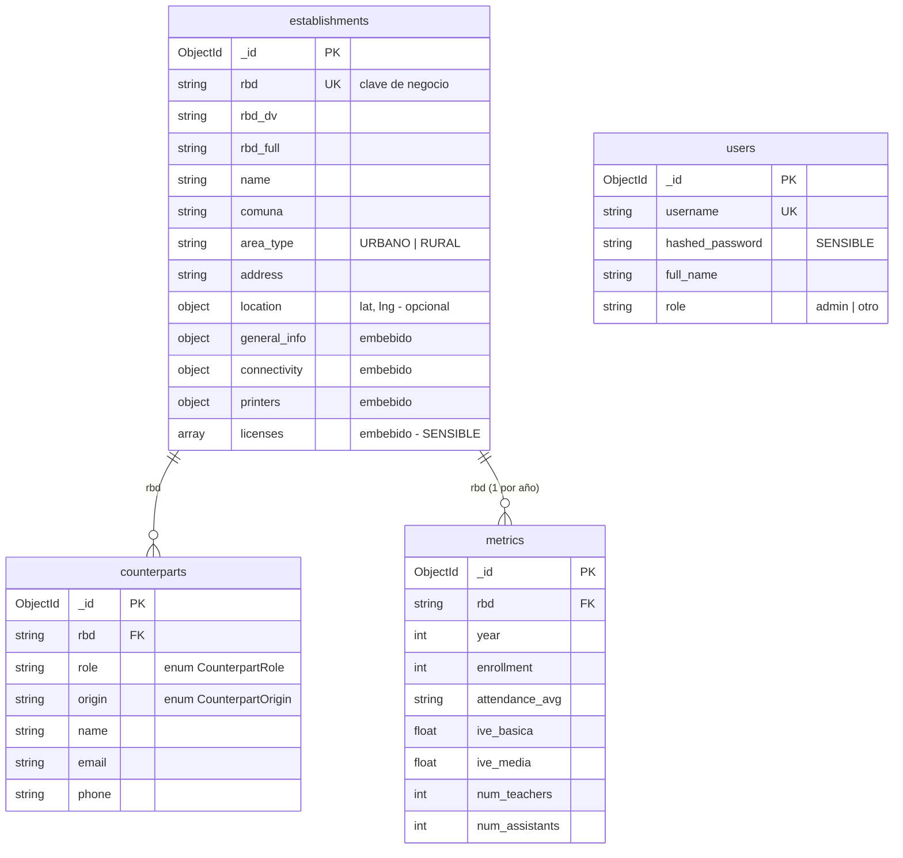
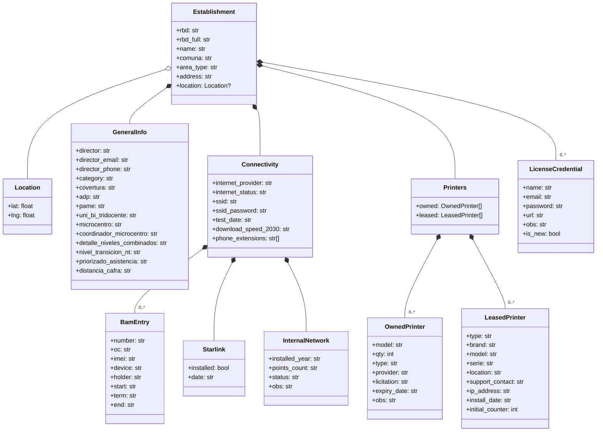
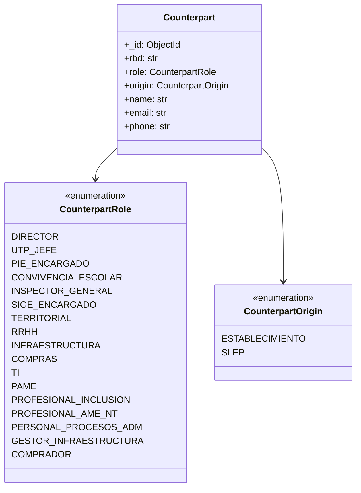
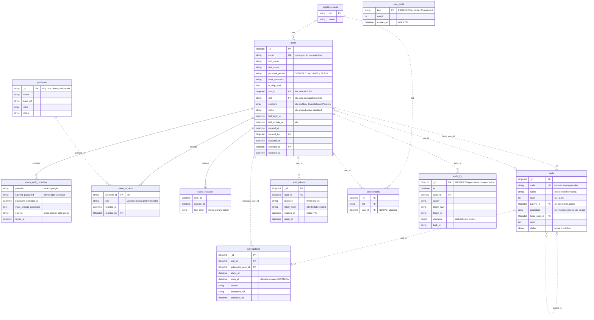
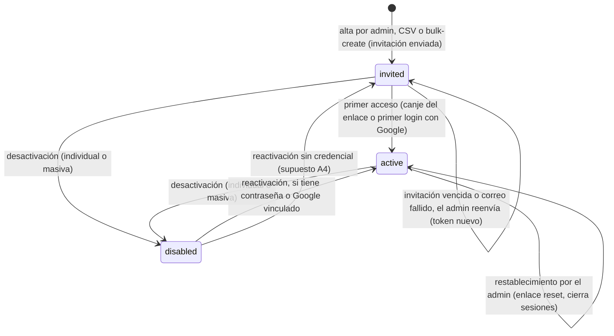

# 02 · Modelo de datos

> **Alcance.** Las cuatro colecciones de MongoDB, su esquema real derivado de los modelos
> Pydantic, sus índices, sus relaciones y el razonamiento documental detrás. Incluye el mapa
> de campos sensibles. No cubre cómo se exponen por HTTP (`03`) ni quién puede verlos (`04`).
>
> **Verificado contra:** `backend/app/*/*_entity.py`, `backend/app/database/database_service.py`,
> `backend/app/database/seed_service.py`, `backend/app/establishments/establishments_service.py`,
> `backend/establishments.json`.

---

## 1. Panorama

Base de datos `slep_llanquihue` (`config.py:6`, override por `DATABASE_NAME`). Cuatro
colecciones:



**Lo que el diagrama dice y conviene no perder de vista:** la clave que une todo no es el
`ObjectId` de Mongo sino el **`rbd`**, un identificador de negocio externo asignado por el
MINEDUC. `counterparts.rbd` y `metrics.rbd` referencian `establishments.rbd`, no `_id`. No
existe integridad referencial declarada — MongoDB no la ofrece y el código no la simula:
borrar un establecimiento dejaría sus contrapartes y métricas huérfanas (hoy no existe
endpoint de borrado de establecimientos, así que el escenario no es alcanzable por la API).

`users` no tiene relación con las otras tres. Es una colección de autenticación aislada.

> **Tras F3** esa colección es el modelo de identidad del módulo `users` (§6 y §9.3), y existen
> además `units` y `platforms` (§9.4 y §9.5). Las secciones 2 a 5 y 8 no cambian.

---

## 2. Principio de modelado: qué se embebe y qué se referencia

La regla aplicada, y la razón por la que este modelo se ve como se ve:

**Se embebe lo que solo tiene sentido dentro de un establecimiento y se lee siempre junto a él.**
`general_info`, `connectivity`, `printers` y `licenses` no se consultan nunca por sí solos —
no hay una pregunta legítima como "todas las impresoras arrendadas del servicio" que no pase
por el establecimiento. Además su cardinalidad es acotada y no crece con el tiempo. Embebidos
significan una sola lectura para armar la ficha completa.

**Se referencia lo que tiene vida propia o crece indefinidamente.** `counterparts` y `metrics`
son colecciones separadas por dos razones distintas, no por una:

- `counterparts` porque se consulta **transversalmente**: "todos los encargados TI de la red"
  es una pregunta real y frecuente, y embebida sería un `$unwind` sobre 78 documentos. Ver
  `06-decisiones-adr.md` ADR-002.
- `metrics` porque **crece un documento por año y por establecimiento, para siempre**. Embebido
  sería un array que crece sin techo dentro de un documento con límite de 16 MB, y obligaría a
  traer toda la historia para leer el año actual. Ver ADR-003.

El criterio para una entidad nueva es ese, en ese orden: *¿se consulta sin su establecimiento?*
→ colección. *¿crece sin límite?* → colección. Si ninguna de las dos, se embebe.

---

## 3. `establishments`

Origen del esquema: `backend/app/establishments/establishments_entity.py`.

### 3.1 Nivel raíz — `Establishment`

| Campo | Tipo | Default | Notas |
|---|---|---|---|
| `rbd` | `str` | requerido | Clave de negocio. Índice único. **Es string, no int**, aunque el dato sea numérico. |
| `rbd_dv` | `str` | `""` | Dígito verificador. |
| `rbd_full` | `str` | requerido | Formato `7722-3`. En el seeding cae a `f"{rbd}"` si falta (`seed_service.py:197`). |
| `name` | `str` | requerido | Índice simple. |
| `comuna` | `str` | requerido | Índice compuesto con `area_type`. |
| `area_type` | `str` | requerido | `URBANO` / `RURAL`. **Sin `Enum`** — es texto libre validado solo por convención. |
| `address` | `str` | requerido | |
| `location` | `Location \| None` | `None` | `{lat: float, lng: float}`. Poblado por el script KMZ. |
| `general_info` | `GeneralInfo` | instancia vacía | Embebido 1:1. |
| `connectivity` | `Connectivity` | instancia vacía | Embebido 1:1. |
| `printers` | `Printers` | instancia vacía | Embebido: `{owned: [], leased: []}`. |
| `licenses` | `List[LicenseCredential]` | `[]` | **Embebido y sensible.** |

### 3.2 Sub-esquemas embebidos



Dos detalles del diagrama que no se ven a simple vista pero determinan el comportamiento:

**Casi todo es `str`, incluso lo que parece numérico o de fecha.** `InternalNetwork.points_count`
es un string, `Connectivity.download_speed_2030` es un string, todas las fechas
(`test_date`, `install_date`, `expiry_date`, `BamEntry.start/term/end`) son strings. Esto es
deliberado: el dato viene de planillas donde una celda puede contener `"30"`, `"30 puntos"` o
`"s/i"`, y tipar fuerte habría hecho fallar el seeding masivamente. El costo es que no se puede
ordenar ni filtrar por rango sobre esos campos sin normalizar primero. Ver ADR-005.

**Los defaults mutables son instancias compartidas.** `Connectivity.starlink: Starlink = Starlink()`
(`establishments_entity.py:69`) evalúa el default una sola vez al importar el módulo. Pydantic v2
hace copia profunda de los defaults al instanciar, así que en la práctica no hay fuga entre
instancias — pero es un patrón que en Pydantic v1 o en dataclasses puras sería un bug clásico.
Quien copie este estilo a otro módulo debe saber por qué funciona.

### 3.3 Variantes del modelo

`establishments_entity.py` declara cuatro modelos sobre la misma entidad, y la distinción es
central para todo lo demás:

| Modelo | Uso | Campos |
|---|---|---|
| `Establishment` | Respuesta del detalle y del PUT | Todo, incluido `licenses` |
| `EstablishmentUpdate` | Body del PUT | Los mismos que `Establishment` menos `rbd`/`rbd_dv`/`rbd_full`, **todos `Optional` con default `None`** |
| `EstablishmentSummary` | Ítem del listado | `rbd`, `rbd_full`, `name`, `comuna`, `area_type`, `address`, `category`, `adp`, `covertura` |
| `EstablishmentListResponse` | Envoltorio del listado | `items`, `total`, `page`, `page_size`, `total_pages` |

`EstablishmentSummary` **aplana** tres campos: `category`, `adp` y `covertura` viven dentro de
`general_info` en el documento, pero salen al mismo nivel en el listado. Ese aplanamiento lo
hace el service a mano (`establishments_service.py:70-73`), no Pydantic. Es el punto exacto
donde un campo nuevo de `general_info` que deba aparecer en el directorio necesita tres
cambios coordinados: la proyección, el aplanamiento y el modelo.

> 🔸 **BRECHA:** `EstablishmentSummary` no incluye `location`, y `LISTING_PROJECTION`
> (`establishments_service.py:6-17`) tampoco lo proyecta. Un mapa con todos los establecimientos
> del directorio requeriría hoy 78 llamadas al endpoint de detalle. El mapa existente
> (`EstablishmentMap.jsx`) es por eso de un solo establecimiento, alimentado desde la ficha.

### 3.4 Índices

`database_service.py:37-56`, función `ensure_indexes()`:

| Colección | Índice | Opciones | Motivo |
|---|---|---|---|
| `establishments` | `rbd` | **unique** | Clave de negocio; garantiza unicidad y acelera el detalle |
| `establishments` | `(comuna, area_type)` | compuesto | Filtros combinados del directorio |
| `establishments` | `name` | simple | Orden por defecto del listado (`sort("name", 1)`) |
| `establishments` | `general_info.category` | simple | Filtro por categoría |
| `counterparts` | `rbd` | simple | Contrapartes de una ficha |
| `counterparts` | `(rbd, role)` | compuesto | Búsqueda de un rol en un EE |
| `metrics` | `(rbd, year)` | **unique**, `year` descendente | Clave compuesta de negocio; impide dos registros del mismo año |
| `metrics` | `year` | simple | `$match: {year: 2026}` de los pipelines de analytics |

Todos con `background=True`.

> 🔸 **BRECHA:** no hay índice sobre `counterparts.role` por sí solo. La consulta transversal
> que justifica la existencia de la colección ("todos los TI de la red", ver ADR-002) hace
> hoy un collection scan. A 78 establecimientos es irrelevante; es el primer índice a agregar
> si esa consulta se expone como endpoint.
>
> 🔸 **BRECHA:** no existe índice único sobre `(rbd, role, origin)` en `counterparts`. El
> `POST /api/counterparts` no valida duplicados, así que la API permite crear dos directores
> para el mismo establecimiento. El seeding sí se protege con un `seen_roles` en memoria
> (`seed_service.py:137`), pero esa protección no existe en tiempo de ejecución.

---

## 4. `counterparts`

Origen: `backend/app/counterparts/counterparts_entity.py`.



Cada documento es **una asignación**, no una persona: un profesional del SLEP que atiende
cinco establecimientos aparece como cinco documentos con el mismo `name` y `email`. No hay
entidad "persona" ni deduplicación. Es la consecuencia directa de modelar la relación y no
las entidades — aceptable mientras nadie necesite "todos los EE que atiende Fulano"
consultando por identidad en vez de por nombre literal.

`role` es el **discriminador**: agregar un tipo de contraparte es agregar un valor al `Enum`,
no una columna ni un campo nuevo. `origin` responde a quién emplea a esa persona, y es lo que
permite separar la ficha en "contrapartes del establecimiento" y "contrapartes del SLEP".

`Counterpart` (`counterparts_entity.py:46-50`) expone `_id` como `id` vía
`Field(..., alias="_id")` + `populate_by_name = True`. **El JSON de salida usa `_id`**, no `id`,
porque FastAPI serializa por alias. El frontend lo consume así (`EditFicha.jsx:179,194`).

### 4.1 El mapeo de seeding, y por qué es frágil

`seed_service.py:109-190` traduce el bloque `counterparts` plano de `establishments.json`
a documentos tipados. Tiene tres partes que conviene conocer antes de tocarlo:

1. **`role_mappings`** (`:113-128`): diccionario de `campo_en_json → (ROLE, ORIGIN)`. Catorce
   roles fijos. Para cada uno busca además `{campo}_email` y `{campo}_phone`.
2. **`year_variant_roles`** (`:133-135`): solo `territorial`. El dato origen trae claves con
   sufijo de año (`territorial_2026`) porque el profesional rota. El código ordena las claves
   candidatas en reversa para preferir la más reciente, en vez de hardcodear el año. Es el
   único lugar del backend que resuelve una clave dinámicamente.
3. **El director** (`:181-190`) no viene del bloque `counterparts` sino de
   `general_info.director`. Se inserta como contraparte `DIRECTOR`/`ESTABLECIMIENTO` **y**
   permanece duplicado dentro de `general_info` del establecimiento.

> 🔸 **BRECHA (duplicación conocida):** el director existe en dos lugares —
> `establishments.general_info.director` y un documento en `counterparts`. Editar uno no
> actualiza el otro. El frontend lee el de `general_info` en la cabecera de la ficha y el de
> `counterparts` en la pestaña de contrapartes, así que pueden divergir visiblemente.
>
> 🔸 **BRECHA:** `role_mappings` descarta el valor literal `"-"` como "sin dato"
> (`seed_service.py:142`). Ese centinela no está documentado en ninguna parte del modelo
> y no se aplica en ningún otro campo.

---

## 5. `metrics`

Origen: `backend/app/metrics/metrics_entity.py`.

Clave compuesta de negocio **`(rbd, year)`**, con índice único. Un documento por
establecimiento y año. 26 campos, agrupables en:

| Grupo | Campos | Tipo |
|---|---|---|
| Clave | `rbd`, `year` | `str`, `int` |
| Matrícula y dotación | `enrollment`, `num_teachers`, `num_assistants` | `int` |
| Asistencia | `attendance_avg` | **`str`** |
| Vulnerabilidad | `ive_basica`, `ive_media` | `float` |
| Resultados de curso | `grade_avg`, `promoted`, `failed`, `transferred`, `dropouts` | `float`/`int` |
| Categoría de desempeño | `desempeno_basica`, `desempeno_media` | `str` |
| Prueba de admisión | `ptje_nem`, `ptje_ranking`, `score_lectura`, `score_matematica1`, `score_matematica2`, `score_historia`, `score_ciencia`, `total_rendidores` | `float`/`int` |
| Tasas derivadas | `tasa_promocion`, `tasa_reprobacion`, `tasa_desercion`, `tasa_retencion` | `float` |

Salvo `rbd`, `year` y `enrollment`, todos son `Optional` con default numérico `0` o `0.0`.
Eso significa que **un cero no distingue "valor real cero" de "sin dato"**: un establecimiento
sin educación media tiene `ive_media = 0.0` igual que uno cuyo IVE no se ha cargado. Toda
agregación sobre estos campos hereda esa ambigüedad.

Las tasas (`tasa_*`) son **derivadas y almacenadas**, no calculadas al vuelo. Vienen ya
computadas desde la planilla origen. Nada en el backend verifica que `tasa_promocion` sea
coherente con `promoted / enrollment`.

`MetricUpdate` (`:36-61`) repite los 24 campos no-clave como `Optional[...] = None`. Es
duplicación literal de `MetricBase`, mantenida a mano.

> 🔸 **BRECHA:** `attendance_avg` es `str` y contiene valores como `"92%"`. No se puede sumar
> ni promediar en un pipeline de agregación sin parseo previo. Es el único campo de la familia
> "porcentaje" que no es `float`, y proviene de que la planilla lo traía formateado.
>
> 🔸 **BRECHA:** el seeding histórico (`seed_service.py:94-105`) inserta los años 2022-2025
> con **solo 5 campos** (`enrollment`, `attendance_avg`, `ive_*`, `num_*`), dejando los 20
> restantes ausentes del documento. Al leerlos por `GET /api/metrics/establishment/{rbd}`,
> `response_model=Metric` los rellena con sus defaults, así que el cliente recibe ceros
> indistinguibles de datos reales. Solo el año 2026 tiene el documento completo.
>
> 🔸 **BRECHA:** `MetricUpdate` duplica la lista de campos de `MetricBase`. Agregar una métrica
> exige editar ambos modelos; olvidar uno hace que el campo sea legible pero no editable, sin
> error visible. Ver `05-guia-de-extension.md` §2.3.

---

## 6. `users`

Módulo dueño: `users` (`users_entity.py`, `users_service.py`); `auth` ya no lee la colección
directamente (C2, ADR-013). El documento y sus invariantes están en §9.3; aquí lo que importa
para leer el código:

- `users_entity.py` modela la **entrada** (`UserCreate`, `UserAdminUpdate`, `UserSelfUpdate`, los
  tres con `extra="forbid"`) y la **salida** (`User`, `UserSummary`, `UserMe`), que no declaran
  `hashed_password` ni `token_hash`. La regla «funcionario SLEP XOR usuario de establecimiento»
  es una sola función, `check_mode`, usada por el alta y por la edición.
- El documento almacenado guarda `unit_id`, `created_by`, `updated_by` y `access[].granted_by` como
  `ObjectId`; los services los devuelven como `str`.
- **Migración del admin sembrado (hecha en F3, §9.10).** El documento original
  `{username, hashed_password, full_name, role}` se completa en el mismo `_id` y **conserva** esos
  cuatro campos legados, de modo que volver al código anterior sigue funcionando. Los tokens con
  `sub = "admin"` se aceptan mientras dure la compatibilidad.
- **Índices** (`database_service.ensure_indexes`): `email` único **parcial** (el admin legado no
  tiene correo y un índice único normal haría chocar los documentos sin el campo),
  `auth_providers.subject` único parcial, `username` parcial, `unit_id`, `rbd`, `positions`
  (multikey), `access.platform_id`, `status`, `last_activity_at`.

> ✅ **RESUELTO:** existen `users_entity.py`, `users_service.py` y los endpoints de gestión de
> usuarios (`03` §8). El índice sobre `username` ya existe (parcial, no único: es solo para la
> compatibilidad del login legado).
>
> 🔸 **BRECHA:** el índice `username` no es único y no hay manera de impedir un segundo documento
> con `username: "admin"`. Solo importa mientras exista la compatibilidad con el login legado;
> se retira con ella.

---

## 7. Mapa de campos sensibles

Este es el inventario que cualquier cambio debe respetar. Su enforcement está en
`04-seguridad-y-acceso.md` §3; aquí solo se listan **dónde viven**.

| Campo | Ubicación | Naturaleza | Tratamiento |
|---|---|---|---|
| `licenses[].password` | `establishments` (embebido) | Credencial de plataforma externa (SIGE, etc.) | `[REDACTED]` para no-admin (`establishments_service.py:89-91`) |
| `licenses[].email` | `establishments` | Usuario de esa credencial | **Sin redactar.** Viaja completo a cualquier autenticado. |
| `connectivity.ssid_password` | `establishments` | Clave de la red WiFi del establecimiento | `[REDACTED]` para no-admin (`:92-93`) |
| `licenses` (array completo) | `establishments` | — | **Excluido de `LISTING_PROJECTION`**: nunca aparece en el listado, para ningún rol |
| `connectivity` (bloque) | `establishments` | Contiene el SSID y su clave | Excluido de `LISTING_PROJECTION` |
| `general_info.director_email`, `director_phone` | `establishments` | Datos personales | Sin redactar. Excluidos del listado solo por no estar proyectados. |
| `counterparts[].email`, `.phone` | `counterparts` | Datos personales de funcionarios | **Sin redactar ni restringir.** Cualquier autenticado lee todas las contrapartes. |
| `LeasedPrinter.ip_address`, `.support_*`, `.director_*` | `establishments` | Dirección IP interna y contactos | Sin redactar. Excluidos del listado por proyección. |
| `users.auth_providers[].hashed_password` y el legado `users.hashed_password` | `users` | Hash bcrypt | Nunca sale: ningún modelo de respuesta lo declara y `test_INT07_*` recorre el JSON de cada ruta buscándolo |
| `users.personal_phone` | `users` | Dato personal (Ley 19.628; Ley 21.719 desde dic-2026) | Fuera de `USERS_LISTING_PROJECTION`; solo lo reciben el admin global (detalle) y el propio usuario (`/me`) |

> 🔸 **BRECHA:** la redacción es una **lista blanca de dos campos**, codificada como dos `if`
> literales en `find_by_rbd`. Un campo sensible nuevo no queda protegido por omisión: hay que
> acordarse de agregarlo ahí. El dato personal de las contrapartes (correo y teléfono de
> funcionarios identificados) no tiene ninguna protección por rol.

---

## 8. Datos semilla y su ciclo de vida

`backend/establishments.json` (78 registros, **git-ignored** por `.gitignore:4`) es la fuente.
Claves de nivel raíz por registro: `rbd`, `rbd_dv`, `name`, `comuna`, `area_type`, `address`,
`general_info`, `metrics`, `counterparts`, `connectivity`, `printers`, `location`.

`seed_if_empty` (`database_service.py:32`, delega en `seed_service.seed_if_empty`,
`database/seed_service.py:9`) descompone cada registro en tres destinos: `metrics` y
`counterparts` salen a sus colecciones, y el resto arma el documento de `establishments`
(`seed_service.py:194-207`).

**Hallazgos verificados sobre esa descomposición:**

> ✅ **RESUELTO:** el documento que arma el seeding (`est_doc`, `seed_service.py:202`) incluye
> `"location": item.get("location")`. Sembrar una base desde cero ya carga las coordenadas de
> los 74/78 registros que las traen en `establishments.json` — antes se perdían porque
> `scripts/import_kmz_locations.py` solo escribía directamente en MongoDB (además del JSON), y
> esa escritura no sobrevivía a una recreación de la base. El script KMZ sigue siendo la única
> vía para *incorporar* coordenadas nuevas (lee el KMZ, actualiza `establishments.json` y, de
> paso, la base ya corriendo); el seeding ahora solo es responsable de *propagarlas* al crear
> la base desde cero.
>
> 🔸 **BRECHA:** `est_doc` incluye `"licenses": item.get("licenses", [])`, pero
> `establishments.json` **no tiene** la clave `licenses` en ningún registro. Todo el aparato
> de `LicenseCredential`, la redacción de `password` y los tests BE-05 / INT-02 protegen hoy
> un array que siempre se siembra vacío. La funcionalidad es correcta y los tests la cubren
> con datos sintéticos; simplemente no hay dato real cargado por esa vía.
>
> 🔸 **BRECHA:** `rbd_full` no existe en el JSON origen, así que el seeding cae al fallback
> `f"{rbd}"` (`:210`) y el `rbd_full` de todos los establecimientos queda igual al `rbd`, sin
> el dígito verificador — aunque `rbd_dv` sí esté presente y se guarde aparte.

**El seeding es todo-o-nada y no es una migración.** Solo corre si la colección está vacía.
No existe mecanismo de actualización incremental: cargar datos nuevos sobre una base ya
poblada requiere hoy vaciar las colecciones y reiniciar, o escribir en Mongo a mano. Ver
`07-operacion.md` §4.

---

## 9. 🧭 DISEÑO F2: colecciones de la feature de usuarios e IAM

> **Estado por subsección (2026-10-02).** ✅ Implementado y verificado en F3: 9.1 (salvo
> `auth_tokens`, `subrogations`, `audit_log`, `rate_limits` y `counterparts.user_id`), 9.2, 9.3,
> 9.4, 9.5, 9.10 y 9.12 (salvo las transiciones por correo). 🧭 Pendiente: 9.6 `subrogations`
> y 9.7 `auth_tokens` (F4), 9.8 `counterparts.user_id` (F4), 9.9 `audit_log` y `rate_limits` (F4).
> La marca `🧭` se retira cuando la fase correspondiente lo implemente y un test lo verifique. Decisiones: ADR-009 a ADR-014 (`06`). Nombres de colecciones
> y campos en inglés, igual que los cinco módulos existentes (ver D23 en `05` §5).

### 9.1 Panorama



Nueve colecciones y tres subdocumentos embebidos. Las colecciones existentes son `establishments` (solo se muestran `rbd` y `name`) y
`counterparts`, que gana `user_id` opcional. Las nuevas son `users`, `units`, `subrogations`,
`platforms` y `auth_tokens`; `audit_log` y `rate_limits` son de la épica de endurecimiento
(ADR-014). **Línea continua: subdocumento embebido** (`auth_providers`, `access`, `invitation`
no existen sin su usuario). **Línea punteada: referencia lógica** entre colecciones; igual que
hoy con `rbd`, MongoDB no impone integridad referencial y la validan los services.

Un usuario tiene `unit_id` (si es funcionario SLEP) o `rbd` (si es de un establecimiento),
**nunca ambos ni ninguno**. `units` se referencia a sí misma por `parent_id` y guarda `ancestors`,
la ruta desde la raíz, para consultar un subárbol con un índice. `users.invitation` guarda el
estado de la invitación (cuándo se envió, cuándo vence, último error) para que el admin vea los
fallos del correo sin que `users` tenga que leer `auth_tokens`, que es de `auth` (ADR-013).
`hashed_password` y `token_hash` son sensibles.

### 9.2 ✅ Organigrama del SLEP

```mermaid
flowchart TD
    DE["DE · Dirección Ejecutiva<br/>nivel 1"]:::head
    GAB["GAB · Gabinete<br/>nivel 2"]
    JUR["JUR · Jurídica<br/>nivel 2"]
    COM["COM · Comunicaciones<br/>nivel 2"]
    AUD["AUD · Auditoría<br/>nivel 2"]
    SDGP["SD-GP · Subdirección de Gestión de Personas<br/>nivel 3"]
    SDAF["SD-AF · Subdirección de Administración y Finanzas<br/>nivel 3"]:::head
    SDGT["SD-GT · Subdirección de Gestión Territorial<br/>nivel 3"]
    UATP["UATP · Unidad de Apoyo Técnico Pedagógico<br/>nivel 3"]
    SDPC["SD-PC · Subdirección de Planificación y Control<br/>nivel 3"]
    GPREM["GP-REM · Remuneraciones"]
    GPPA["GP-PA · Procesos Administrativos"]
    GPFD["GP-FD · Formación y Desarrollo"]
    AFCL["AF-CL · Compras y Logística"]
    AFTI["AF-TI · Tecnologías de la Información"]:::head
    AFFIN["AF-FIN · Finanzas"]:::head
    GTGT["GT-GT · Gestión Territorial"]
    GTCAC["GT-CAC · Coordinación de Atención Ciudadana"]
    ATMC["AT-MC · Mejora Continua"]
    ATMS["AT-MS · Monitoreo y Seguimiento"]
    PCINF["PC-INF · Infraestructura"]
    PCMAN["PC-MAN · Mantenimiento"]
    PCCG["PC-CG · Control de Gestión"]
    DE --> GAB & JUR & COM & AUD
    DE --> SDGP & SDAF & SDGT & UATP & SDPC
    SDGP --> GPREM & GPPA & GPFD
    SDAF --> AFCL & AFTI & AFFIN
    SDGT --> GTGT & GTCAC
    UATP --> ATMC & ATMS
    SDPC --> PCINF & PCMAN & PCCG
    AFFIN -. "subroga a SD-AF · VACACIONES · hasta 16-oct-2026 (ejemplo)" .-> SDAF
    classDef head stroke-width:3px,stroke:#d97706
```



Son 23 unidades: 1 de nivel 1, 4 de nivel 2 (asesoras, hijas de Dirección Ejecutiva y sin hijas
propias), 5 de nivel 3 y 13 de nivel 4. No hay unidades de nivel 5, pero el modelo las admite.
Borde grueso: unidades con jefatura en el ejemplo; la línea punteada es una subrogancia vigente
de ejemplo. «Gestión Territorial» aparece dos veces (`SD-GT` nivel 3 y `GT-GT` nivel 4), por eso
el `code` es el identificador y el nombre es un dato.

| Nivel | `code` | Nombre | Padre |
|---|---|---|---|
| 1 | `DE` | Dirección Ejecutiva | — |
| 2 | `GAB` · `JUR` · `COM` · `AUD` | Gabinete · Jurídica · Comunicaciones · Auditoría | `DE` |
| 3 | `SD-GP` | Subdirección de Gestión de Personas | `DE` |
| 3 | `SD-AF` | Subdirección de Administración y Finanzas | `DE` |
| 3 | `SD-GT` | Subdirección de Gestión Territorial | `DE` |
| 3 | `UATP` | Unidad de Apoyo Técnico Pedagógico | `DE` |
| 3 | `SD-PC` | Subdirección de Planificación y Control | `DE` |
| 4 | `GP-REM` · `GP-PA` · `GP-FD` | Remuneraciones · Procesos Administrativos · Formación y Desarrollo | `SD-GP` |
| 4 | `AF-CL` · `AF-TI` · `AF-FIN` | Compras y Logística · Tecnologías de la Información · Finanzas | `SD-AF` |
| 4 | `GT-GT` · `GT-CAC` | Gestión Territorial · Coordinación de Atención Ciudadana | `SD-GT` |
| 4 | `AT-MC` · `AT-MS` | Mejora Continua · Monitoreo y Seguimiento | `UATP` |
| 4 | `PC-INF` · `PC-MAN` · `PC-CG` | Infraestructura · Mantenimiento · Control de Gestión | `SD-PC` |

Los códigos son una propuesta pendiente de validación del usuario; los cuatro dados como
referencia (`GP-REM`, `AF-TI`, `GT-GT`, `PC-INF`) se respetaron. Un nodo de nivel 4 se guarda así:

```json
{"code":"AF-TI","name":"Tecnologías de la Información","level":4,
  "parent_id":"<_id de SD-AF>","ancestors":["<_id de DE>","<_id de SD-AF>"],
  "head_user_id":"<_id>","status":"active"}
```

### 9.3 ✅ `users`

Módulo dueño: `users` (ADR-013). `auth` ya no lee esta colección directamente.

```json
{
  "_id": "ObjectId",
  "email": "nombre.apellido@slepllanquihue.cl",
  "first_name": "…", "last_name": "…",
  "personal_phone": "+56912345678", "work_extension": "4521",
  "is_slep_staff": false, "unit_id": null, "rbd": "7722",
  "positions": ["DOCENTE", "PIE_ENCARGADO"],
  "status": "invited | active | disabled",
  "auth_providers": [
    {"provider": "local", "hashed_password": "…", "password_changed_at": "ISODate", "must_change_password": false},
    {"provider": "google", "subject": "…", "linked_at": "ISODate"}
  ],
  "access": [{"platform_id": "datos", "role": "editor", "granted_at": "ISODate", "granted_by": "ObjectId"}],
  "invitation": {"sent_at": "ISODate", "expires_at": "ISODate", "last_error": null},
  "last_login_at": "ISODate", "last_activity_at": "ISODate",
  "created_at": "ISODate", "created_by": "ObjectId", "updated_at": "ISODate", "updated_by": "ObjectId",
  "disabled_at": null
}
```

- `email` se normaliza (`strip` + `lower`) **antes de guardar y antes de buscar**, y su dominio debe
  estar en `ALLOWED_EMAIL_DOMAINS` (`@slepllanquihue.cl`, también para el personal de
  establecimientos). `work_extension` es un string de dígitos. `personal_phone` es E.164 chileno.
- **`positions`** es una lista de `EstablishmentPosition(str, Enum)`, con **al menos un valor**
  para usuarios de establecimiento y vacía para funcionarios SLEP. Valores cerrados:
  `DIRECTOR`, `UTP_JEFE`, `PIE_ENCARGADO`, `CONVIVENCIA_ESCOLAR`, `INSPECTOR_GENERAL`,
  `SIGE_ENCARGADO`, `SECRETARIO`, `ADMINISTRADOR`, `DOCENTE`, `ASISTENTE_EDUCACION`. Los seis
  primeros coinciden con `CounterpartRole` (`counterparts_entity.py:10-15`), de modo que un
  filtro futuro pueda cruzar ambas colecciones. **No existe `ENCARGADO_CONVIVENCIA`:** duplicaría
  `CONVIVENCIA_ESCOLAR`, el valor al que `seed_service.py:125` mapea `convivencia_encargado`.
- El `role` de la raíz del documento actual pasa a `access[]`, con compatibilidad hacia atrás
  mientras dure la migración (§9.10).

**Invariantes (cada uno con su test):**

| Invariante | Quién lo hace cumplir |
|---|---|
| `is_slep_staff=true` ⇒ `unit_id` con valor, `rbd` nulo y `positions` vacía. `false` ⇒ `rbd` con valor, `positions` con ≥ 1 elemento y `unit_id` nulo | `model_validator` de Pydantic |
| `rbd` existe en `establishments` | `users_service`, vía `establishments_service` (L5) |
| `unit_id` existe y la unidad está activa | `users_service`, vía `units_service` |
| `access[].role` pertenece a `platforms.roles` de esa plataforma; una entrada por plataforma | `users_service`, vía `platforms_service` |
| Siempre queda al menos un usuario activo con `iam/admin`; no se desactiva ni degrada al último, tampoco en masa | `users_service` |
| Un admin global no puede desactivarse a sí mismo | `users_service` |
| `hashed_password` y `token_hash` no aparecen en ninguna respuesta | un test recorre el JSON completo, como INT02 |

**Índices:** `email` único **parcial** (`{email: {$type: "string"}}`: el admin legado no tiene
correo y dos documentos sin el campo chocarían en un índice único normal);
`auth_providers.subject` único parcial (solo `provider: "google"`); `unit_id`; `rbd`;
`positions` (multikey); `access.platform_id`; `status`; `last_activity_at`.

### 9.4 ✅ `units`

```json
{"_id":"ObjectId","code":"SD-GT","name":"Subdirección de Gestión Territorial","level":3,
  "parent_id":"ObjectId|null","ancestors":["ObjectId(DE)"],"head_user_id":"ObjectId|null",
  "order":3,"status":"active|inactive","created_at":"ISODate","updated_at":"ISODate"}
```

`code` es un slug en mayúsculas, único y **estable: no cambia si la unidad se renombra**; es lo
que el CSV usa para referirla. Invariantes: una sola unidad de nivel 1 sin padre; niveles 2 y 3
cuelgan del nivel 1, el 4 del 3 y el 5 del 4; el nivel 2 no tiene hijas; el nombre es único entre
hermanas; mover reescribe los `ancestors` de todo el subárbol; no se desactiva una unidad con
usuarios activos ni con hijas activas. **Índices:** `code` único; `(parent_id, name)` único;
`ancestors` (multikey); `level`. **Seed:** `units_service.ensure_bootstrap_units()` desde una
constante del módulo, solo con la colección vacía.

### 9.5 ✅ `platforms`

```json
{"_id":"datos","name":"Gestión de Establecimientos","base_url":"https://datos.slepllanquihue.gob.cl",
  "roles":["admin","editor","viewer"],"status":"active"}
```

Sembradas: `iam` (roles `["admin"]`), `datos` y `selloverde` (`["admin","editor","viewer"]`).
`_id` es un slug estable. `iam` es una plataforma lógica (ADR-009). El dominio **de correo** es
`@slepllanquihue.cl`; el **web** es `*.slepllanquihue.gob.cl`. No son el mismo. Las credenciales
y URLs de redirección de las plataformas consumidoras se diseñan en F7 (`04` §10).

### 9.6 🧭 `subrogations` (propiedad de `units`, prioridad Could)

```json
{"_id":"ObjectId","unit_id":"ObjectId","subrogate_user_id":"ObjectId","starts_at":"ISODate",
  "ends_at":"ISODate|null","reason":"VACACIONES|LICENCIA|COMISION|VACANCIA|OTRO",
  "document_ref":"Resolución Exenta N° …|null","created_by":"ObjectId","created_at":"ISODate",
  "cancelled_at":"ISODate|null"}
```

Colección aparte porque el historial crece sin límite (ADR-010). «Vigente» se calcula por fecha,
sin jobs. Reglas: la registra el admin global; quien subroga está activo, no es la jefatura
titular y pertenece al subárbol de la unidad; no se superponen dos vigentes en una unidad;
`ends_at` es obligatorio salvo `VACANCIA`. **No transfiere permisos.**

### 9.7 🧭 `auth_tokens` (propiedad de `auth`)

```json
{"_id":"ObjectId","user_id":"ObjectId","purpose":"invite|reset","token_hash":"sha256(…)",
  "expires_at":"ISODate","used_at":"ISODate|null","created_by":"ObjectId","created_at":"ISODate"}
```

El token (`secrets.token_urlsafe(32)`) solo viaja en el correo; la base guarda su hash. Índice TTL
sobre `expires_at`. Emitir uno nuevo invalida el anterior del mismo usuario y propósito.
Vigencia propuesta: 72 h (`invite`) y 24 h (`reset`).

### 9.8 🧭 `counterparts`: cambio

Se agrega `user_id: Optional[str] = None`, nunca obligatorio (ADR-011). El backfill es un script
con dry-run por defecto que empareja por correo normalizado.

### 9.9 🧭 `audit_log` y `rate_limits` (ADR-014)

```json
{"_id":"ObjectId","at":"ISODate","actor_id":"ObjectId","action":"user.create|access.grant|…",
  "target_type":"user|unit|subrogation","target_id":"…","changes":{"campo":["antes","después"]},"bulk_id":"string|null"}
```

`audit_log` es solo de agregado; `changes` jamás contiene hashes, contraseñas ni tokens.
`rate_limits` guarda `{key, count, expires_at}` con índice TTL.

### 9.10 ✅ Migración del admin sembrado

Hoy el único usuario es `{username, hashed_password, full_name, role}` (§6) y no tiene correo.
`users_service.ensure_bootstrap_admin()` (invocado por `run_bootstrap()` en `main.py`, desde el `lifespan`, **después** de
`db_service.connect()`, que ya hace seed de establecimientos e índices) lo migra en el mismo `_id`: `email` desde
`BOOTSTRAP_ADMIN_EMAIL` (obligatoria, sin default), `auth_providers` con el hash original,
`access` `iam/admin` y `datos/admin`, `status: active`, y la unidad `AF-TI`. Es idempotente y
tolera la carrera de dos workers (`DuplicateKeyError`). Con la base vacía crea el admin con
`ADMIN_PASSWORD` y `must_change_password: true`. `seed_service._seed_admin_user` se retira, y
`ensure_bootstrap_units()` corre antes. Rollback: el documento conserva `username`,
`hashed_password` y `role` durante la migración, así que volver al código anterior sigue
funcionando.

### 9.11 Campos sensibles nuevos

| Campo | Ubicación | Tratamiento previsto |
|---|---|---|
| `users.auth_providers[].hashed_password` | `users` | Nunca sale. Test que recorre el JSON. |
| `auth_tokens.token_hash` | `auth_tokens` | Nunca sale. |
| `users.personal_phone` | `users` | Dato personal (Ley 19.628; Ley 21.719 desde dic-2026). Fuera de la proyección del listado; solo lo ven el admin global y el propio usuario. |
| `users.email`, nombres | `users` | Visibles solo para `iam/admin` y el propio usuario; `GET /api/units` solo expone id y nombre a mostrar de las jefaturas. |
| `GMAIL_REFRESH_TOKEN`, `GOOGLE_CLIENT_SECRET` | entorno | Secretos como `JWT_SECRET`. Nunca en el repo ni en logs. |

### 9.12 Ciclo de vida del usuario



Todo usuario nace `invited` (alta individual, CSV o `bulk-create`). Si el correo falla, sigue
`invited` y `users.invitation.last_error` lo muestra; si el enlace vence, el admin reenvía y se
emite un token nuevo que invalida el anterior. Pasa a `active` con el primer acceso (canje del
enlace o primer login con Google). Desactivar es el «eliminar» (soft delete): corta la sesión en
la siguiente petición y es reversible. Reactivar deja `active` si el usuario tiene contraseña o
Google vinculado; si nunca definió credencial, vuelve a `invited`. Restablecer la contraseña
deja `active` y cierra las sesiones abiertas.
