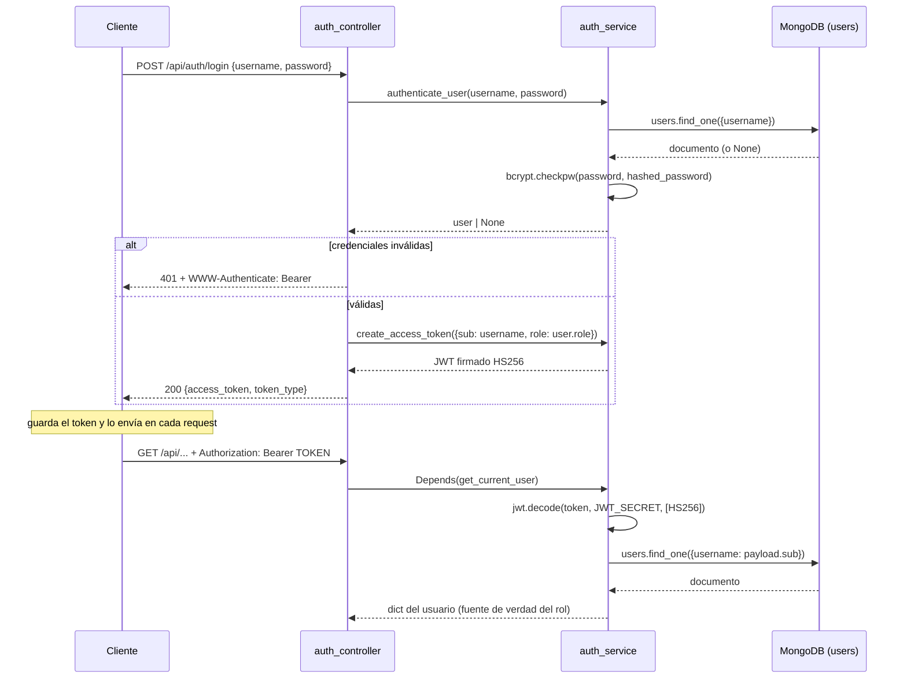
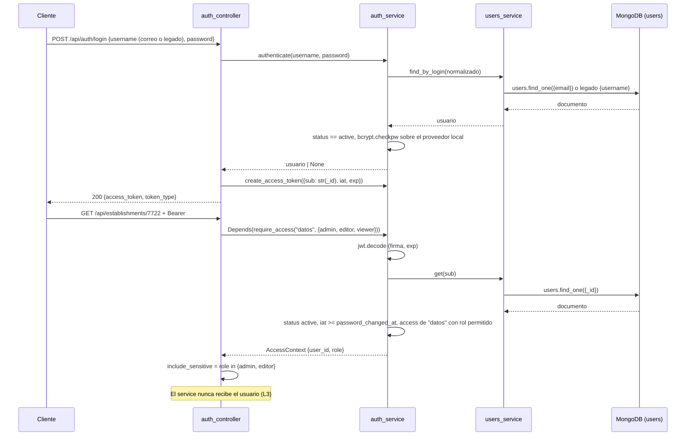
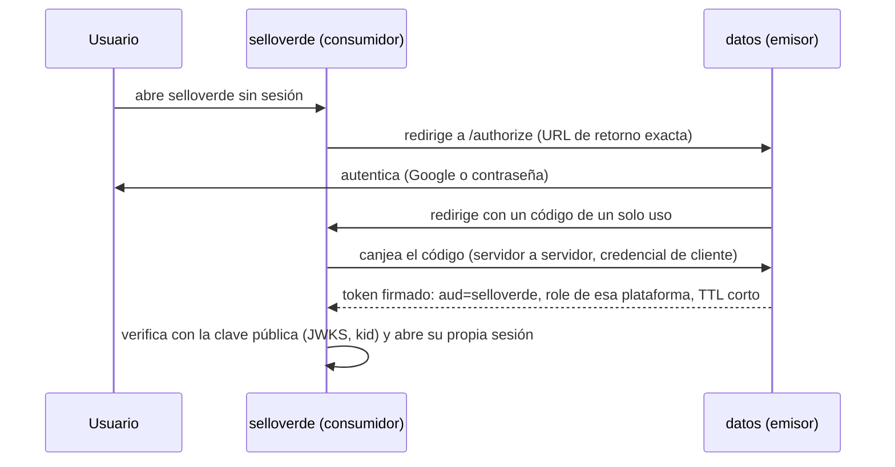

# 04 · Seguridad y control de acceso

> 🧭 **Las secciones §9 y §10 son DISEÑO F2, aprobado el 2026-10-02 y sin implementar.** Las
> secciones 1 a 8 describen el código actual y siguen siendo ciertas hasta que la fase F3 las
> reemplace; ahí se retirarán las brechas D3, D4 y la de `require_admin` que cierra §9.

> **Alcance.** Autenticación, modelo de roles, protección de campos sensibles y los invariantes
> que los tests garantizan. **Documento obligatorio antes de tocar `auth/`, las proyecciones o
> cualquier campo marcado como sensible en `02-modelo-datos.md` §7.**
>
> **Verificado contra:** `backend/app/auth/*`, `backend/app/config.py`, `backend/app/main.py`,
> `backend/app/establishments/*`, `backend/tests/test_BE03_*`, `test_BE05_*`, `test_INT02_*`,
> `docker-compose*.yml`, `.env.production.template`, `frontend/src/App.jsx`, `Login.jsx`.

---

## 1. Flujo de autenticación



**Hashing** (`auth_service.py:14-22`): `bcrypt` directo, `gensalt()` por contraseña,
`checkpw` envuelto en `try/except` que devuelve `False` ante cualquier excepción — un hash
corrupto en la base se traduce en "credenciales inválidas", no en un 500.

**Emisión** (`auth_service.py:32-40`): payload `{sub: username, role: <rol>, exp: <UTC>}`,
firmado HS256 con `settings.JWT_SECRET`. Expiración por defecto 180 minutos.

**Verificación** (`auth_service.py:42-60`): decodifica (firma y `exp` los valida PyJWT),
extrae `sub`, y **vuelve a leer el usuario desde MongoDB**. Esa relectura es la decisión de
diseño más importante del módulo y conviene entenderla:

> **El `role` del token no se usa nunca para autorizar.** El rol efectivo se toma del documento
> de `users` recién leído. Consecuencia: degradar a un usuario en la base surte efecto en su
> siguiente petición, sin esperar a que expire su token. El costo es una consulta a MongoDB por
> cada request autenticada. A esta escala es el intercambio correcto; en un escenario de alto
> tráfico sería el primer candidato a caché, y ahí habría que reintroducir conscientemente la
> ventana de propagación que hoy no existe.

Cualquier fallo — token ausente, firma inválida, expirado, `sub` ausente, usuario borrado —
produce el mismo `401` con `WWW-Authenticate: Bearer`. No se distingue el motivo hacia afuera,
lo cual es correcto.

**Lado cliente** (`frontend/src/App.jsx:26-44`, `Login.jsx:36-40`): el token se guarda en
`localStorage`, se instala como `axios.defaults.headers.common['Authorization']`, y un
interceptor de respuesta cierra la sesión ante cualquier `401`. Al montar la app, si hay token
guardado se llama `GET /api/auth/me` para rehidratar la sesión y validar el token de una vez.

> 🔸 **BRECHA:** el token vive en `localStorage`, accesible desde JavaScript, por lo que
> cualquier XSS en la SPA lo exfiltra. La alternativa habitual (cookie `HttpOnly` + `SameSite`)
> exigiría CSRF tokens y cambiar el esquema Bearer. Es una decisión consciente de simplicidad,
> pero no está registrada como tal en ningún ADR.

---

## 2. Modelo de roles

El modelo es más simple de lo que su vocabulario sugiere.

- **Valores conocidos:** `"admin"` (sembrado, `seed_service.py:30`) y `"viewer"` (aparece
  solo en fixtures de test, `tests/conftest.py:173`). No hay enumeración: `role` es texto libre
  en un documento sin esquema.
- **Punto de aplicación:** **uno solo en todo el backend** —
  `establishments_controller.py:40`, `is_admin = current_user.get("role") == "admin"`.
- **Todo lo demás** solo distingue "autenticado" de "no autenticado", vía
  `Depends(auth_service.get_current_user)`.

### 2.1 Matriz recurso × rol × operación

| Recurso / operación | Anónimo | Autenticado (no admin) | Admin |
|---|---|---|---|
| `GET /` | ✅ | ✅ | ✅ |
| `/docs`, `/redoc`, `/openapi.json` | ✅ | ✅ | ✅ |
| `POST /api/auth/login`, `/login-form` | ✅ | ✅ | ✅ |
| `POST /api/auth/logout` | ✅ | ✅ | ✅ |
| `GET /api/auth/me` | ❌ 401 | ✅ | ✅ |
| `GET /api/establishments` (listado) | ❌ | ✅ sin campos sensibles | ✅ igual |
| `GET /api/establishments/{rbd}` | ❌ | ✅ **con passwords redactadas** | ✅ **con passwords en claro** |
| `PUT /api/establishments/{rbd}` | ❌ | ✅ **y la respuesta trae passwords en claro** | ✅ |
| `GET/POST/PUT/DELETE /api/counterparts/*` | ❌ | ✅ completo | ✅ igual |
| `GET/PUT /api/metrics/*` | ❌ | ✅ completo | ✅ igual |
| `GET /api/analytics/*` | ❌ | ✅ | ✅ igual |

Leído de golpe, el modelo real es: **autenticado = puede escribirlo todo; admin = además ve
dos campos de credenciales en claro.** El rol no restringe ninguna operación de escritura.

> 🔸 **BRECHA (elevación de privilegio funcional):** un usuario `viewer` puede modificar
> cualquier establecimiento, crear y borrar contrapartes y sobrescribir métricas. El nombre del
> rol sugiere solo lectura; el código no lo impone en ningún punto. Es la brecha de seguridad de
> mayor impacto práctico.
>
> 🔸 **BRECHA (fuga por escritura):** `PUT /api/establishments/{rbd}` responde con
> `find_by_rbd(include_sensitive=True)` (`establishments_service.py:110,118`) sin consultar el
> rol. Un `viewer` obtiene las contraseñas en claro emitiendo un PUT vacío — exactamente lo que
> BE-05 impide en el GET. **No hay test que cubra este camino.**
>
> 🔸 **BRECHA:** no existe dependencia reutilizable tipo `require_admin`. El único chequeo de rol
> es una comparación de string inline. Un módulo nuevo no tiene de dónde heredar el patrón, así
> que lo más probable es que lo reinvente o lo omita. Ver `05-guia-de-extension.md` §3.

---

## 3. Protección de campos sensibles

Dos mecanismos independientes, con alcances distintos. Confundirlos es la fuente de error más
probable al modificar el listado o el detalle.

### 3.1 Exclusión por proyección — protege el **listado**

`LISTING_PROJECTION` (`establishments_service.py:6-17`) es una proyección **de inclusión**:
enumera los 10 campos que se leen y MongoDB descarta todo lo demás en el servidor de base de
datos. `connectivity`, `printers` y `licenses` no viajan siquiera dentro del proceso Python.

Esta protección es **por lista blanca**, y eso importa: un campo sensible nuevo en el documento
queda protegido en el listado **por omisión**. Es el mecanismo robusto de los dos.

### 3.2 Redacción por rol — protege el **detalle**

`find_by_rbd(rbd, include_sensitive=False)` (`establishments_service.py:84-95`) sustituye por
la cadena literal `"[REDACTED]"`:

- cada `licenses[].password` no vacío;
- `connectivity.ssid_password` si no está vacío.

El controller decide el booleano (`establishments_controller.py:40-41`). El service nunca sabe
qué es un rol; el controller nunca sabe qué campo se redacta. Esa separación es la que permite
probar ambos lados por separado, y es la que hay que preservar.

Esta protección es **por lista negra**, con dos entradas literales. Un campo sensible nuevo
**no** queda protegido por omisión: hay que agregarlo a mano.

> 🔸 **BRECHA:** la redacción es destructiva sobre el documento que ya se leyó completo desde
> MongoDB. El dato sensible sí cruzó la frontera de la base al proceso. En caso de excepción
> entre la lectura y la redacción, o de un log que serialice el documento antes de redactar,
> el valor real queda expuesto. Lo robusto sería no leerlo (proyección de exclusión) cuando no
> se necesita.
>
> 🔸 **BRECHA:** `licenses[].email` — el usuario de cada credencial externa — **no se redacta**.
> Media credencial viaja completa a cualquier autenticado.

---

## 4. Invariantes garantizados por los tests

Los tests del backend son la **especificación ejecutable** de esta sección. Un cambio que los
rompa está cambiando una garantía de seguridad, no un detalle de implementación.

| Invariante | Test que lo protege | Qué se rompe si se viola |
|---|---|---|
| `LISTING_PROJECTION` existe como constante exportable de `establishments_service` | `test_BE03_listing_projection_constant_exists` | Cualquier refactor que la haga local o inline |
| La proyección **excluye** `licenses`, `connectivity`, `printers` | `test_BE03_listing_projection_excludes_sensitive_fields` | Agregar cualquiera de los tres a la proyección "para que la UI no pida el detalle" |
| La proyección **incluye** los campos que el directorio necesita | `test_BE03_listing_projection_includes_required_fields` | Quitar un campo del listado y romper la tabla del frontend |
| `find_all()` pasa efectivamente la proyección al cursor | `test_BE03_find_all_applies_projection_to_cursor` | Declarar la constante y olvidar usarla |
| Ningún documento del listado tiene `licenses` | `test_BE03_find_all_result_has_no_licenses_field` | Regresión del anterior, verificada sobre el resultado |
| `find_by_rbd()` **no** usa la proyección del listado | `test_BE06_find_by_rbd_returns_full_document_not_projected` | "Unificar" ambas lecturas en una sola con proyección — vaciaría la ficha |
| El payload del listado completo pesa < 50 KB | `test_BE03` (docstring) | Reintroducir bloques pesados en el listado |
| `find_by_rbd()` acepta `include_sensitive` | `test_BE05_find_by_rbd_accepts_include_sensitive_param` | Cambiar la firma sin adecuar el controller |
| No-admin recibe `licenses[].password == "[REDACTED]"` | `test_BE05_non_admin_receives_redacted_license_password` | Quitar o invertir la redacción |
| Admin recibe la contraseña real | `test_BE05_admin_receives_real_license_password` | Redactar siempre (rompería la función de la ficha para TI) |
| No-admin recibe `ssid_password == "[REDACTED]"` | `test_BE05_non_admin_receives_redacted_ssid_password` | Olvidar el segundo campo al refactorizar |
| Admin recibe el `ssid_password` real | `test_BE05_admin_receives_real_ssid_password` | — |
| El controller pasa `include_sensitive=True` solo para admin | `test_BE05_controller_passes_include_sensitive_true_for_admin` / `..._false_for_viewer` | Mover la decisión de rol al service, o hardcodearla |
| **Integración:** `GET /api/establishments` nunca incluye `licenses` en ningún ítem | `test_INT02_listing_response_never_contains_licenses_field` | Cualquier regresión de los anteriores, vista desde HTTP real |
| **Integración:** el JSON del listado no contiene la clave `password` en ninguna parte | `test_INT02_listing_response_does_not_contain_password_string_anywhere` | Agregar un campo que contenga la subcadena `password` al listado |
| **Integración:** el detalle con token no-admin trae passwords redactadas | `test_INT02_detail_with_non_admin_token_returns_redacted_passwords` | — |
| **Integración:** el detalle con token admin trae passwords reales | `test_INT02_detail_with_admin_token_returns_real_passwords` | — |

Los tests corren contra MongoDB **mockeado** (`tests/conftest.py`: `AsyncMock`/`MagicMock`
sobre `db_service.db`), no contra una instancia real. Verifican la lógica del backend, no el
comportamiento de MongoDB ni la existencia física de los índices.

> 🔸 **BRECHA:** no hay test que cubra la fuga por `PUT` descrita en §2. El conjunto BE-05/INT-02
> verifica exhaustivamente la lectura y deja la escritura sin cubrir.

---

## 5. CORS

`main.py:35-41`:

```python
allow_origins=["*"]
allow_credentials=True
allow_methods=["*"]
allow_headers=["*"]
```

En la práctica el frontend propio no depende de esto: va por rutas relativas detrás del mismo
origen (Nginx o el proxy de Vite), así que nunca hace una petición cross-origin.
`allow_origins=["*"]` afecta solo a clientes servidos desde otro origen.

> 🔸 **BRECHA:** `allow_origins=["*"]` junto a `allow_credentials=True` es una combinación que
> la especificación CORS prohíbe; los navegadores la rechazan y el middleware de Starlette
> responde con el origen reflejado. El efecto neto es **permitir credenciales desde cualquier
> origen**. El propio código lo admite en un comentario (`main.py:37`:
> `# In production, specify exact domains`). Como el esquema es Bearer y el token va en una
> cabecera que el atacante no puede inyectar desde otro origen sin XSS, el riesgo práctico es
> menor que el aparente — pero es una configuración a corregir y una lista de orígenes por
> variable de entorno es la forma esperada.

---

## 6. Secretos y configuración

`config.py` lee variables de entorno con `os.getenv` y **todas tienen default**:

| Variable | Default en el código | Riesgo |
|---|---|---|
| `MONGODB_URL` | `mongodb://localhost:27017` | Bajo (falla ruidosamente) |
| `DATABASE_NAME` | `slep_llanquihue` | Bajo |
| `JWT_SECRET` | `super-secret-slep-key-2026-llanquihue-digital-management` | **Crítico** |
| `ACCESS_TOKEN_EXPIRE_MINUTES` | `180` | Bajo |
| `ADMIN_PASSWORD` | `admin123` | **Crítico** |

> 🔸 **BRECHA (crítica):** `JWT_SECRET` y `ADMIN_PASSWORD` tienen valores por defecto
> funcionales y presentes en el repositorio. Un despliegue que olvide definirlos arranca sin
> error: emite tokens firmados con un secreto público — cualquiera que lea el código puede
> falsificar un token de admin — y siembra el usuario `admin` con la contraseña `admin123`.
> **Fallar al arrancar sería el comportamiento correcto para ambos.**
>
> 🔸 **BRECHA:** `docker-compose.yml` (desarrollo) repite ese mismo `JWT_SECRET` literal, lo que
> normaliza su uso y aumenta la probabilidad de que llegue a producción por copia.
>
> 🔸 **BRECHA:** `config.py` usa una clase plana con anotaciones de tipo que Python no valida en
> tiempo de ejecución. `ACCESS_TOKEN_EXPIRE_MINUTES` sí se convierte con `int()`, pero un valor
> no numérico produce un `ValueError` en el import, no un mensaje útil. `pydantic-settings`
> daría validación y fallo explícito; hoy no se usa.

**Producción sí está bien planteada.** `.env.production.template` obliga a rellenar todos los
valores, incluye el comando para generar el secreto
(`python -c "import secrets; print(secrets.token_hex(64))"`), y `docker-compose.prod.yml` los
inyecta por entorno junto con autenticación de MongoDB. El problema no es el procedimiento, es
que nada lo hace obligatorio.

---

## 7. Superficie expuesta y lo que no existe

| Aspecto | Estado |
|---|---|
| TLS | Fuera del repositorio. Nginx escucha en `:80` y se publica en `127.0.0.1:8080` |
| MongoDB en producción | No publicada al host; auth root habilitada |
| Rate limiting | **No existe** — el login admite intentos ilimitados |
| Bloqueo por intentos fallidos | **No existe** |
| Auditoría de accesos | **No existe** — ningún registro de quién leyó o modificó qué |
| Validación de entrada | Solo la de Pydantic. `$regex` sin escapar (ver `03` §3.4) |
| Cabeceras de seguridad (CSP, HSTS, X-Frame-Options) | **No configuradas** en `nginx.conf` |
| `/openapi.json`, `/docs` | **Públicos** — exponen el esquema completo a cualquiera |
| Secretos en el repositorio | `establishments.json` y `Documentacion/` están git-ignored; `JWT_SECRET` por defecto **sí está** en el código versionado |

> 🔸 **BRECHA:** sin rate limiting ni bloqueo, `POST /api/auth/login` admite fuerza bruta
> ilimitada contra una base con un solo usuario conocido (`admin`). Es la combinación de esta
> ausencia con el default `admin123` la que la hace relevante.

---

## 8. Checklist antes de tocar código de esta área

1. ¿El campo que agrego es sensible según `02-modelo-datos.md` §7? Si sí: **no** lo agregues a
   `LISTING_PROJECTION` y **sí** agrégalo a la redacción de `find_by_rbd`.
2. ¿Estoy cambiando `LISTING_PROJECTION`? Corre `test_BE03` e `test_INT02` y **presenta la
   salida real** (regla 1 de `GEMINI.md`).
3. ¿Estoy tocando `auth/`? Es un punto único de falla: rama aislada y punto de restauración
   antes de empezar (regla 3 de `GEMINI.md`).
4. ¿Mi endpoint nuevo escribe datos? Decide explícitamente si debe exigir admin, y si la
   respuesta puede contener campos sensibles. Hoy no hay ninguna dependencia que lo haga por ti.
5. ¿Mi endpoint devuelve un documento de establecimiento? Verifica por qué rama de
   `include_sensitive` pasa.

---

## 9. 🧭 DISEÑO F2: modelo de acceso por plataforma

> **Estado: sin implementar.** Decisiones: ADR-009 (acceso y roles), ADR-012 (primer acceso),
> ADR-013 (dependencias) y ADR-014 (auditoría y límites) en `06`. Modelo de datos en `02` §9;
> contrato en `03` §8. **Documento obligatorio antes de tocar `auth/`:** F3 y F6 tocan un punto
> único de falla, así que valen la rama aislada y los tests BE03, BE05 e INT02 antes y después.

### 9.1 Flujo objetivo



El flujo conserva la decisión de diseño de §1: el rol **no** se toma del token sino del documento
recién leído, de modo que revocar un acceso o desactivar a alguien surte efecto en su siguiente
petición, sin ventana de propagación. El costo sigue siendo una consulta por request autenticada.

### 9.2 `require_access(platform, roles)`

Dependencia de FastAPI definida en `auth`, que cada controller declara por ruta
(`Depends(require_access("datos", {"admin", "editor"}))`). Devuelve un `AccessContext {user_id,
role}`. Responde `401` si la sesión no es válida (token, usuario inexistente o no `active`,
sesión anterior a un cambio de contraseña) y `403` si el usuario no tiene un rol permitido en esa
plataforma. Un rol desconocido en `access[]` no concede nada. Reemplaza la comparación inline de
`establishments_controller.py:40`.

**Toda ruta declara `require_access` o está en una allowlist explícita** (`/`, `/docs`, `/redoc`,
`/openapi.json`, `login`, `login-form`, `logout`, `password-policy`, `set-password`,
`auth/config`, `auth/google`). Un test recorre `app.routes` y falla ante una ruta nueva sin
declarar. Cierra la brecha «no existe dependencia reutilizable tipo `require_admin`» de §2.

### 9.3 Matriz de roles

Las tres plataformas comparten los roles `admin` (ver, editar y eliminar), `editor` (ver y
editar) y `viewer` (solo ver); `iam` solo tiene `admin`. Reemplaza la matriz de §2.1.

| Operación en `datos` | `viewer` | `editor` | `admin` |
|---|---|---|---|
| `GET` de establecimientos, contrapartes, métricas y analytics | ✅ | ✅ | ✅ |
| Ver `licenses[].password` y `ssid_password` en claro | ❌ redactado | ✅ | ✅ |
| `PUT` / `POST` de ficha, contrapartes y métricas | ❌ `403` | ✅ | ✅ |
| `DELETE /api/counterparts/{id}` | ❌ `403` | ❌ `403` | ✅ |
| `/api/users/*` (salvo `/me`), escritura en `/api/units/*` y `/api/platforms/*`, `/api/audit` | solo con `iam/admin` | solo con `iam/admin` | solo con `iam/admin` |
| `GET` y `PATCH /api/users/me`, `GET /api/units*`, `POST /api/auth/password` | ✅ | ✅ | ✅ |

**`datos/admin` no es `iam/admin`**: separación de funciones (C12). **Sin acceso a `datos` ⇒ `403`**
en todas las rutas de datos, aunque el usuario esté autenticado.

> ⚠️ **Amplía quién ve secretos.** Hoy solo el admin ve `licenses[].password` y `ssid_password`.
> Con esta matriz también los ve el `editor` (lectura confirmada de la respuesta N10). Si esa
> lectura fuera errónea, `include_sensitive` queda solo para `admin` y la protección contra la
> sobrescritura de secretos redactados (9.7) deja de ser inalcanzable solo por diseño.

### 9.4 Sesión y revocación

- El `sub` del JWT es `str(_id)`: estable, nunca el correo ni un username. `get_current_user`
  acepta además los `sub = username` legados mientras dure la migración. Un `sub` malformado da
  `401`, no `500`.
- El token lleva `iat`. **Se rechaza un token con `iat` anterior a `password_changed_at`** del
  usuario; la comparación se hace truncada al segundo para no rechazar el token emitido en el
  mismo segundo del cambio. Cambiar o restablecer la contraseña cierra todas las sesiones previas.
  El cambio propio devuelve un token nuevo para que la sesión actual continúe.
- Un usuario `disabled` o `invited` con token vigente recibe `401` en la siguiente request.
- Todo fallo de autenticación sigue siendo el mismo `401` con `WWW-Authenticate: Bearer`.
- `last_login_at` se escribe en cada login; `last_activity_at` como máximo cada 5 minutos por
  usuario, con un `update_one` condicional (seguro con 2 workers) y sin consulta extra.
- Una contraseña actual incorrecta al cambiarla responde `400`/`403`, **nunca `401`**: el
  interceptor del frontend (`App.jsx:38`) cierra la sesión ante cualquier `401`.

### 9.5 Primer acceso, restablecimiento y contraseñas

- **La contraseña nunca viaja por correo.** Alta ⇒ usuario `invited` ⇒ correo con un enlace de un
  solo uso (`/definir-contrasena#token=…`, en el fragmento) que además ofrece entrar con Google.
  Canjearlo define la contraseña y activa al usuario. Mecanismo, vigencia (72 h / 24 h) y
  atomicidad del canje: ADR-012 y `02` §9.7. Todo fallo de canje responde igual, sin distinguir
  usado, vencido o inexistente.
- **Restablecer** (solo `iam/admin`) usa el mismo mecanismo con `purpose: reset`. El admin nunca
  ve ni define la contraseña.
- **Política (variables de entorno, C17).** `PASSWORD_MIN_LENGTH`, `PASSWORD_MAX_LENGTH` y
  `PASSWORD_REQUIRE_CHAR_CLASSES` (0 a 4); un valor fuera de rango impide el arranque.
  Los defaults siguen **NIST SP 800-63B-4** (rev. 4, 26-ago-2025), §3.1.1.2: mínimo **15**
  caracteres cuando la contraseña es el único factor (8 si hubiera MFA; hoy no hay); permitir al
  menos 64; **sin reglas de composición** (clases en 0); **sin rotación periódica**; y comparar
  contra una lista de contraseñas comunes o comprometidas. Se agregan palabras de contexto (el
  local-part del correo, «slepllanquihue») y normalización NFKC.
- **Límite de bcrypt:** `bcrypt 5.0.0` lanza `ValueError` sobre 72 bytes (verificado en el
  entorno). La política rechaza con `422` lo que exceda 72 bytes en UTF-8 (una frase de 64
  caracteres con acentos puede exceder), en vez de dejar que sea un `500`. Hay una sola función de
  política para el canje del enlace, el cambio propio y el bootstrap; el frontend la consulta en
  `GET /api/auth/password-policy` para validar en vivo y el backend la vuelve a aplicar.
- **Admin sembrado:** `BOOTSTRAP_ADMIN_EMAIL` obligatoria y sin default; con la base vacía, la
  contraseña inicial sale de `ADMIN_PASSWORD` con `must_change_password: true` (`02` §9.10).

### 9.6 Login con Google

El frontend obtiene un `id_token` con Google Identity Services y lo envía a `POST
/api/auth/google`. El backend lo verifica con `google-auth` (en un hilo, porque la verificación
es síncrona): firma, `aud == GOOGLE_CLIENT_ID`, `iss`, expiración, `email_verified`, y que el
claim **`hd`** esté en `ALLOWED_EMAIL_DOMAINS` (no basta con el dominio del correo). **No hay
auto-provisión:** el correo debe existir en `users`; un usuario `invited` pasa a `active` y se
vincula `auth_providers: {provider: "google", subject, linked_at}`. Un usuario ya vinculado cuyo
`sub` de Google no coincide, un usuario `disabled` y un correo desconocido reciben el mismo `401`.
Todos los correos son `@slepllanquihue.cl` (también los del personal de establecimientos).

### 9.7 Invariantes por protegerse y su test previsto

Los IDs siguen la numeración real (último existente: BE08, INT02, FE05).

| Invariante | Test previsto |
|---|---|
| `viewer` no escribe; `editor` no borra; sin acceso a `datos` ⇒ `403`; `datos/admin ≠ iam/admin` | `test_BE12_*` y `test_INT03_role_matrix_over_http` |
| Toda ruta declara `require_access` o está en la allowlist | `test_BE12_every_route_declares_access_or_is_allowlisted` |
| El `PUT` no devuelve credenciales a quien no puede escribir; el marcador `[REDACTED]` no sobrescribe el valor real | `test_BE13_*`, `test_INT04_*` |
| `sub = str(_id)`; sesiones cortadas por desactivación y por cambio de contraseña | `test_BE11_*` |
| `hashed_password`, `token_hash` y `personal_phone` (a terceros) no aparecen en ninguna respuesta | `test_INT07_*` (recorre el JSON, patrón INT02) |
| Siempre queda un `iam/admin` activo, también en masa; nadie se desactiva a sí mismo | `test_BE29_*`, `test_BE41_*`, `test_BE44_*` |
| Inyección de operadores, regex sin escapar (D5) y asignación masiva | `test_INT08_*` y los `422` de cada historia |
| Variables de identidad y secretos sin default; todas declaradas en compose y plantilla | `test_BE14_*` |

### 9.8 Configuración

Variables nuevas, sin default en las de identidad y secreto (la norma de D2): `ALLOWED_EMAIL_DOMAINS`, `BOOTSTRAP_ADMIN_EMAIL`, `PUBLIC_BASE_URL`, `GMAIL_SENDER_ADDRESS`,
`GMAIL_REFRESH_TOKEN`, `GOOGLE_CLIENT_ID`, `GOOGLE_CLIENT_SECRET`; y, por decisión de la fase F3,
`JWT_SECRET` y `ADMIN_PASSWORD` también pierden su default. `MAIL_MODE` (`gmail` o `console`) decide si hacen falta las credenciales de Gmail; ver ADR-012 y `07` §2.1. Con defaults razonables y validación
de rango: la política de contraseñas. Detalle y archivos a actualizar: `07` §2.

### 9.9 Brechas que este diseño cierra y las que deja abiertas

**Cierra:** D2 (defaults de `JWT_SECRET` y `ADMIN_PASSWORD`), D3 (`viewer` escribe), D4 (`PUT` sin
redactar), la ausencia de `require_admin`, la ausencia de auditoría y de rate limiting (si se
implementa E9), y el login ilimitado.
**Sigue abierta:** token en `localStorage` (§1), CORS `*` (§5), cabeceras de seguridad (§7),
`/docs` y `/openapi.json` públicos, redacción de `licenses[].email` y de los datos de
contrapartes (§3), y MFA.

---

## 10. 🧭 Marco de interconexión entre plataformas (F7, solo diseño)

> **Estado: marco aprobado; el ADR detallado y el prototipo son la fase F7.** Aquí solo el
> concepto y los límites. Nada se implementa antes de F7, y **nada del plan de F3 a F6 lo
> bloquea**: `sub` es el `_id` estable, `access[]` ya está por plataforma, `status` ya permite
> negar la emisión de tokens y `platforms` ya existe como registro.

**Dirección.** Este sistema (`datos.slepllanquihue.gob.cl`) pasa a ser el emisor de identidad de
las plataformas bajo `*.slepllanquihue.gob.cl`. Autentica (Google o contraseña local) y emite
**tokens firmados**. Cada plataforma consumidora (hoy `selloverde`) los **verifica de forma local**
con la clave pública y decide la autorización dentro de su contexto, a partir del rol del token.
La autenticación se centraliza; la autorización es local. La fuente de verdad de los accesos es
`users.access[]`. **El contrato entre plataformas es el token y solo el token: ninguna plataforma
lee la base de otra.**



El diagrama es la **recomendación de partida**, no una decisión: el mecanismo de entrega lo
cierra el ADR de F7. Correcciones obligatorias sobre la propuesta que originó este marco:

| # | Defecto de la propuesta | Qué exige el diseño |
|---|---|---|
| 1 | Firmar con una `SECRET_KEY` compartida | **Solo firma asimétrica** (RS256, ES256 o EdDSA); clave privada solo aquí; JWKS en `/.well-known/jwks.json` con `kid` para rotar |
| 2 | Un token con el mapa de accesos de todas las plataformas | **Un token por audiencia** (`aud`), con solo el rol de esa plataforma |
| 3 | Reusar la sesión de `datos` | **La sesión propia nunca sale de aquí**; puede seguir en HS256 |
| 4 | Expiración de 24 h sin revocación | **Access tokens de 5 a 15 min** con renovación aquí; la ventana de revocación es el TTL y queda escrita |
| 5 | Cookie `HttpOnly` de dominio padre y a la vez `Authorization: Bearer` | El ADR elige un mecanismo; recomendado: **redirección con código de un solo uso** (authorization code flow de OIDC, con bibliotecas mantenidas) |
| 6 | Hablar de «descifrar» y poner datos personales en el token | Un JWT firmado **no está cifrado**: claims mínimos `iss`, `sub`, `aud`, `exp`, `iat`, `jti`, `email`, `name`, `role` |
| 7 | «B no necesita tablas de usuarios» | Proyección local mínima en la consumidora: `sub`, `email`, `name`, `last_seen_at`, por upsert al validar. Sin contraseñas ni roles |
| 8 | Presentarlo como si eliminara el punto único de falla | Lo **reduce**: si este sistema cae, nadie inicia sesión en ninguna plataforma; las sesiones abiertas duran hasta su expiración. Se acepta explícitamente |
| 9 | Correo de ejemplo `@slepllanquihue.gob.cl` | El correo es `@slepllanquihue.cl` y el web `*.slepllanquihue.gob.cl`; `hd` de Google se aplica al de correo |

**Restricciones.** Queda **prohibido que una plataforma se conecte a la MongoDB de otra**. Los
endpoints para terceros van versionados desde el primer día (`/api/v1/iam/…` y el JWKS), por D10.
Rate limiting en login, canje y renovación. La plataforma `iam` no se expone: nunca se emite un
token con `aud=iam` y ninguna plataforma puede otorgar `iam/admin`. Cada consumidora se registra
en `platforms` con sus URLs de redirección (lista exacta, sin comodines) y su credencial de
cliente hasheada.

**Construir o adoptar.** Emitir tokens asimétricos, publicar el JWKS y canjear códigos es un
subconjunto acotado de OIDC y se hace con bibliotecas mantenidas (PyJWT con `cryptography`, o
`authlib`/`joserfc`; en NestJS `jose` o `passport-jwt` + `jwks-rsa`). Si el ADR concluye que hace
falta un OIDC completo (discovery, refresh rotativos, consentimiento, logout federado), debe
compararlo antes con Keycloak, Zitadel o Authentik federado con Google.

**Datos pendientes del usuario para el ADR de F7:** stack de `selloverde` (NestJS + PostgreSQL,
según su información), cómo autentica hoy, si comparte host o proxy con este sistema y dónde
termina TLS.
