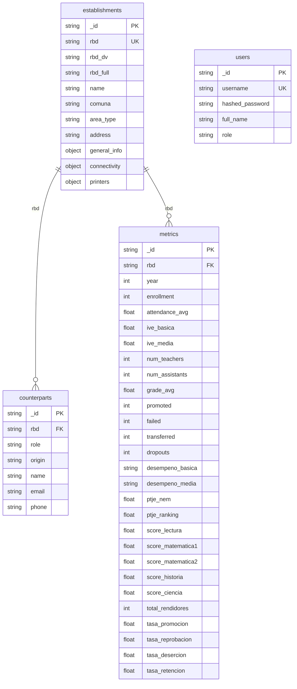
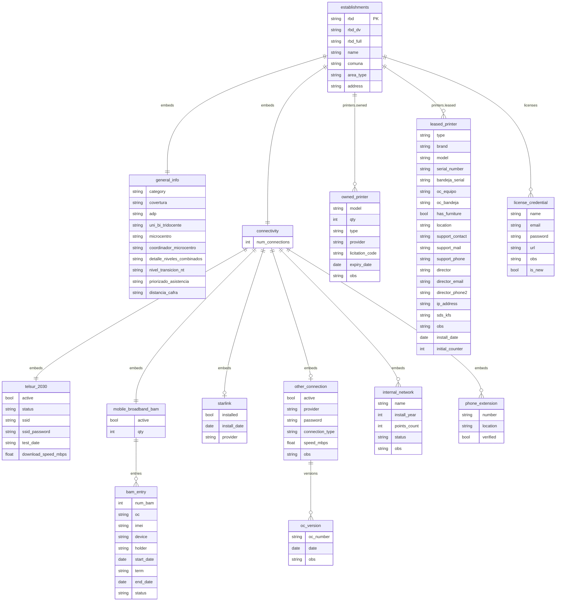
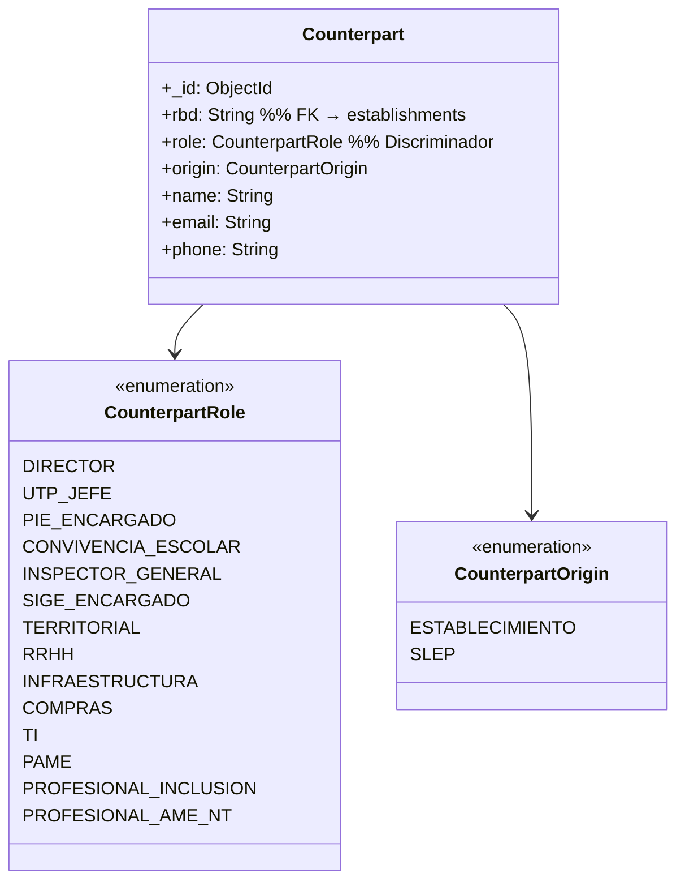
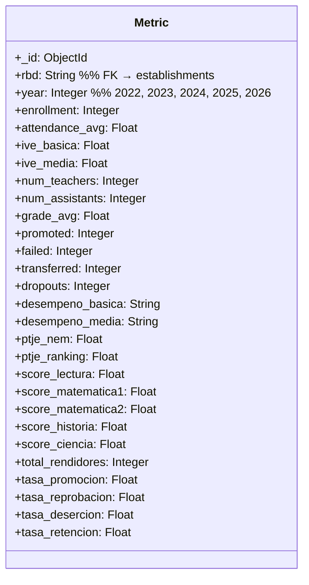
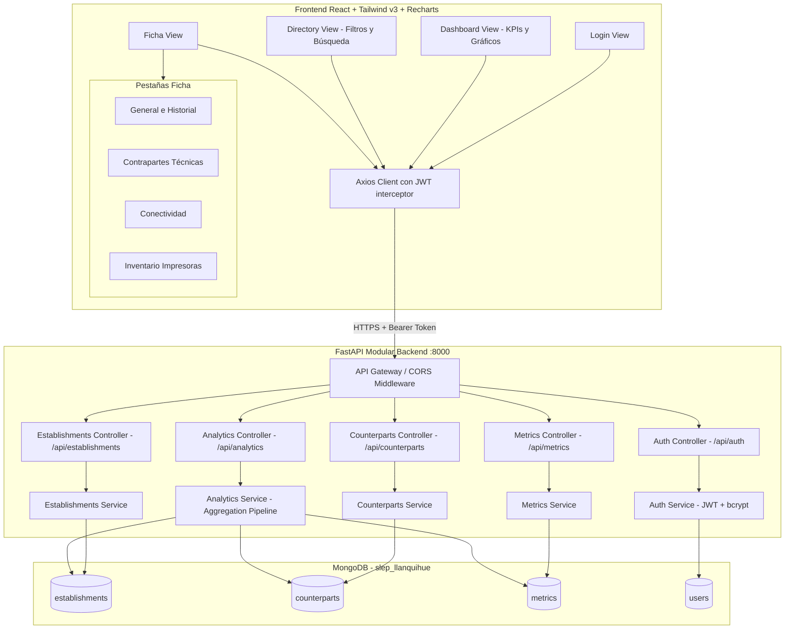

# Plan de Implementación: Sistema de Gestión de Establecimientos (SLEP Llanquihue)
## Iteración 1 – Versión 2 (Modelo de Datos Revisado)

---

## 1. Rediseño del Modelo de Datos

### Principios aplicados
Viniendo de un contexto relacional, el modelo documental de MongoDB puede pensarse como **documentos que embeben colecciones de subdocumentos tipados** en vez de tablas planas con columnas fijas.

Los tres rediseños principales son:

| Problema identificado | Solución aplicada |
|---|---|
| `counterparts` era un objeto con 20+ campos fijos | Array de `Counterpart` con campo discriminador `role` y `origin` (Strategy Pattern) |
| `metrics` era un bloque plano sin historia | Colección separada `metrics` con `rbd` + `year` como clave compuesta → permite cruces |
| Impresoras incompletas (faltan campos de arriendo) | Dos sub-modelos separados y completos: `OwnedPrinter` y `LeasedPrinter` |

---

## 2. Diagrama Entidad-Relación (Modelo Documental Revisado)

### 2.1 Colecciones MongoDB



---

### 2.2 Sub-esquema de `establishments` expandido



---

### 2.3 Counterpart – Patrón tipado (Strategy)

En vez de campos fijos (`territorial`, `rrhh`, `ti`, ...) usamos una colección separada `counterparts` donde cada documento representa una asignación. El campo `origin` discrimina si el encargado pertenece al **establecimiento** o al **SLEP**.



**Ventaja:** Puedes filtrar `db.counterparts.find({role: "TI"})` para obtener todos los encargados TI de la red, o `db.counterparts.find({rbd: "7722"})` para la ficha completa. Esto es el equivalente directo a una tabla de relación `N:M` en SQL.

---

### 2.4 Metrics – Colección versionada por año



**Ventaja para cruces de datos:** Las agregaciones analíticas como "Matrícula Urbana vs Rural 2025-2026" son consultas directas en MongoDB:
```js
db.metrics.aggregate([
  { $match: { year: 2026 } },
  { $lookup: { from: "establishments", localField: "rbd", foreignField: "rbd", as: "est" } },
  { $group: { _id: "$est.area_type", total: { $sum: "$enrollment" } } }
])
```

---

## 3. Estructura Modular del Backend (NestJS-like)

```
backend/
├── app/
│   ├── __init__.py
│   ├── main.py                          # Inicialización FastAPI, montaje CORS y routers
│   ├── config.py                        # Constantes: JWT_SECRET, DB_URL, DB_NAME, TOKEN_EXPIRE_MIN
│   │
│   ├── database/
│   │   ├── __init__.py
│   │   └── database_service.py          # Motor asyncio, seeding desde establishments.json
│   │
│   ├── auth/
│   │   ├── __init__.py
│   │   ├── auth_entity.py               # Pydantic: User, Token, TokenData
│   │   ├── auth_service.py              # bcrypt + JWT create/verify + get_current_user()
│   │   └── auth_controller.py           # POST /api/auth/login, POST /api/auth/logout
│   │
│   ├── establishments/
│   │   ├── __init__.py
│   │   ├── establishments_entity.py     # Pydantic: Establishment, GeneralInfo, Connectivity...
│   │   ├── establishments_service.py    # find_all(filters), find_by_rbd(), update_by_rbd()
│   │   └── establishments_controller.py # GET /api/establishments, GET /{rbd}, PUT /{rbd}
│   │
│   ├── counterparts/
│   │   ├── __init__.py
│   │   ├── counterparts_entity.py       # Pydantic: Counterpart, CounterpartRole (Enum), CounterpartOrigin (Enum)
│   │   ├── counterparts_service.py      # find_by_rbd(), upsert(), delete()
│   │   └── counterparts_controller.py   # GET /api/counterparts/{rbd}, POST, PUT, DELETE
│   │
│   ├── metrics/
│   │   ├── __init__.py
│   │   ├── metrics_entity.py            # Pydantic: Metric (con rbd + year como clave única)
│   │   ├── metrics_service.py           # find_by_rbd(), find_by_year(), upsert()
│   │   └── metrics_controller.py        # GET /api/metrics/{rbd}, GET /api/metrics?year=2026
│   │
│   └── analytics/
│       ├── __init__.py
│       ├── analytics_service.py         # Agregaciones MongoDB: KPIs, gráficos, cruces
│       └── analytics_controller.py      # GET /api/analytics/kpis, GET /api/analytics/charts
│
├── requirements.txt
└── run.py
```

---

## 4. Diagrama de Componentes (Actualizado)



---

## 5. Endpoints de la API

| Módulo | Método | Ruta | Descripción |
|---|---|---|---|
| Auth | POST | `/api/auth/login` | Login con usuario/contraseña → retorna JWT |
| Auth | POST | `/api/auth/logout` | Invalida sesión en el frontend |
| Establishments | GET | `/api/establishments` | Listar con filtros: `search`, `comuna`, `area_type`, `category`, `adp` |
| Establishments | GET | `/api/establishments/{rbd}` | Ficha completa del establecimiento |
| Establishments | PUT | `/api/establishments/{rbd}` | Actualizar datos generales / conectividad / impresoras |
| Counterparts | GET | `/api/counterparts/{rbd}` | Todas las contrapartes de un EE |
| Counterparts | POST | `/api/counterparts` | Crear nueva contraparte |
| Counterparts | PUT | `/api/counterparts/{id}` | Editar contraparte existente |
| Counterparts | DELETE | `/api/counterparts/{id}` | Eliminar asignación |
| Metrics | GET | `/api/metrics/{rbd}` | Historial de métricas de un EE (todos los años) |
| Metrics | GET | `/api/metrics?year=2026` | Métricas de toda la red para un año |
| Metrics | PUT | `/api/metrics/{rbd}/{year}` | Actualizar/crear registro de métricas |
| Analytics | GET | `/api/analytics/kpis` | Contadores globales: EE, matrícula total, docentes, comunas |
| Analytics | GET | `/api/analytics/charts` | Datos para gráficos: matricula por area_type, por comuna, por categoría |

---

## 6. Plan de Verificación

### Pruebas de integración
1. **Database seed:** Verificar 79 documentos en `establishments`, 79×N en `counterparts`, 79×5 en `metrics`.
2. **Auth:** Login correcto → Token; Login incorrecto → 401; Token expirado → 401.
3. **Establishments:** Filtro `area_type=RURAL` → solo rurales; búsqueda por RBD exacto.
4. **Counterparts:** Buscar todas las contrapartes TI de la red (`role=TI`, `origin=SLEP`).
5. **Analytics:** Cruce urbano vs rural para matrícula 2026 retorna dos grupos.

### Manual (Usuario)
1. Iniciar sesión → navegar al Dashboard → validar KPIs y gráficos.
2. Filtrar por Comuna "Frutillar" en el Directorio → verificar resultados.
3. Abrir Ficha RBD 7722 → recorrer las 4 pestañas → editar un campo → confirmar persistencia.
